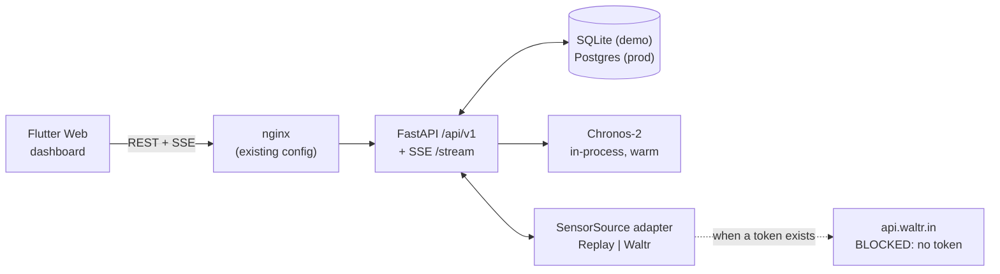

# API design

**Status: proposed. None of these endpoints exist yet.** The current FastAPI service
(`extension/api/`) exposes `/tanks`, `/history`, `/forecast`, `/anomaly-preview`,
`/model-run-comparison`, `/refresh`, `/retrain`, `/sync`, `/task/{id}` — all bound to the retired
AutoGluon predictors. This document specifies its replacement.

Base path: `/api/v1`. All timestamps ISO-8601 UTC. All volumes in KL, all rates in KL/h.

---

## 1. Topology



The forecaster is **in-process**, not a separate service. A 119.5 M-parameter model held warm
answers in ~0.6 s for the whole fleet; an RPC hop would add latency and a failure mode for no
benefit at this scale. The `Forecaster` protocol means extracting it into its own service later
is a deployment change, not a code change.

---

## 2. Conventions

**Envelope.** Success responses return the resource directly. Errors always return:

```json
{ "error": { "code": "tank_not_found", "message": "Unknown tank_id: FOO",
             "detail": {"tank_id": "FOO"}, "correlation_id": "018f…" } }
```

**Provenance is mandatory on every value the UI renders.** Any numeric field that could be
mistaken for a measurement is accompanied by a `provenance` discriminator:

```json
{ "value": 1.42, "unit": "KL/h", "provenance": "actual",
  "as_of": "2026-04-20T14:00:00Z", "quality_flag": "ok" }
```

`provenance ∈ {actual, predicted, forecast, inferred, simulated, stale, unavailable}`.
`unavailable` carries `value: null` — **never `0`**.

**Mode.** Every response carries `"mode": "replay" | "live"` at the top level. The UI renders a
persistent banner from it. There is no endpoint that returns mixed-mode data.

**Pagination.** Cursor-based: `?limit=100&cursor=<opaque>`; response includes `next_cursor`.

**Idempotency.** Mutating endpoints accept `Idempotency-Key`. Required on motor commands.

**Versioning.** Path-versioned. `/api/v1` is additive-only; breaking changes mint `/api/v2`.

---

## 3. Authentication and authorization

Two layers, both already implemented in `extension/api/app/auth.py` and reusable:

1. **User → API: JWT.** Claims per `extension/docs/integration-waltr.md` (`sub`, `role`,
   `location_id`, `iss`, `aud`, `exp`). Verified against a JWKS endpoint. **The exact JWKS URL,
   issuer and audience are still open items with the WALTR team**, and no working token exists
   today — so the demo runs with a local dev issuer and `DEV_AUTH_BYPASS` is explicitly a
   development-only flag that must be absent in any deployed configuration.
2. **Service → service: HMAC.** `x-internal-signature` / `x-internal-timestamp` over
   `METHOD\npath\ntimestamp\nbody`, with a 300 s skew window — the existing
   `HMACAuthMiddleware`.

### Roles

| Role | Read dashboard | Ack alerts | Motor commands | Override / e-stop | Config | Retrain / promote |
|---|---|---|---|---|---|---|
| `viewer` | ✅ | ❌ | ❌ | ❌ | ❌ | ❌ |
| `operator` | ✅ | ✅ | ✅ | ✅ | ❌ | ❌ |
| `admin` | ✅ | ✅ | ✅ | ✅ | ✅ | ✅ |

**A read-only dashboard user never receives motor authority.** Role is checked at the route and
re-checked in the safety gate; the gate does not trust the transport layer. Every motor command,
override, config change and model promotion writes an `audit_log` row before it takes effect.

Emergency stop is the one deliberate asymmetry: **any authenticated role above `viewer` may
trigger an e-stop; only `admin` may clear one.** Stopping is always safe; resuming is not.

---

## 4. REST endpoints

### 4.1 Tanks and state

| Method | Path | Role | Purpose |
|---|---|---|---|
| GET | `/tanks` | viewer | List tanks with static metadata (`geometric_capacity_kl`, `observed_max_level_kl`, `trust_tier`, `routing.forecaster`) |
| GET | `/tanks/{tank_id}` | viewer | One tank, static + config |
| GET | `/tanks/{tank_id}/state` | viewer | Current `tank_state` row, fully provenance-tagged |
| GET | `/state` | viewer | All tanks' state — the global dashboard's single call |
| GET | `/tanks/{tank_id}/health` | viewer | Sensor health: freshness, quality-flag counts over 24 h/7 d, trust tier + score, mass-balance residual, missing % |

`GET /state` response shape (abbreviated):

```json
{
  "mode": "replay",
  "as_of": "2026-04-20T16:00:00Z",
  "sim_ts": "2026-04-20T16:00:00Z",
  "summary": {
    "tank_count": 24, "needing_attention": 3,
    "active_warnings": 5, "active_criticals": 1,
    "motors_running": {"value": 2, "provenance": "simulated"},
    "model_health": "healthy", "intervals_calibrated": false
  },
  "tanks": [{
    "tank_id": "BE_BLOCK_OHT",
    "level": {"value": 5.0, "unit": "KL", "provenance": "actual", "as_of": "2026-04-20T16:00:00Z"},
    "level_pct": {"value": 8.3, "provenance": "actual"},
    "outflow_kl_h": {"value": 2.80, "provenance": "actual"},
    "predicted_outflow_next_h": {"value": 1.62, "provenance": "predicted",
                                 "p10": 0.71, "p90": 3.04, "calibrated": false},
    "data_status": "fresh", "trust_tier": "healthy",
    "motor": {"state": "off", "provenance": "simulated", "since": "2026-04-20T08:00:00Z"},
    "rolling_mae_24h": 0.41, "rolling_mase_24h": 0.76,
    "active_alert_count": 1, "max_active_severity": "warning"
  }]
}
```

### 4.2 Readings

| Method | Path | Role | Purpose |
|---|---|---|---|
| GET | `/tanks/{tank_id}/readings?from=&to=&limit=&include_quality=` | viewer | Historical readings. NULLs preserved as `null` with their quality flag |
| GET | `/tanks/{tank_id}/readings/latest` | viewer | Most recent accepted reading |

### 4.3 Forecasts

| Method | Path | Role | Purpose |
|---|---|---|---|
| GET | `/tanks/{tank_id}/forecast?horizon=24` | viewer | Current forecast at one horizon, with quantiles |
| GET | `/tanks/{tank_id}/forecast/all` | viewer | All six horizons in one call — what the tank detail view uses |
| GET | `/tanks/{tank_id}/forecast/history?from=&to=&horizon=` | viewer | Every forecast *made* in a window, for the replay reveal |
| POST | `/tanks/{tank_id}/forecast:refresh` | operator | Force an inference. Rate-limited; records `triggered_by='manual'` |

`GET /tanks/{id}/forecast?horizon=24`:

```json
{
  "mode": "replay",
  "tank_id": "BE_BLOCK_OHT",
  "run_id": "018f…", "origin_ts": "2026-04-20T16:00:00Z",
  "model_version": {"name": "chronos2-zs", "model_id": "amazon/chronos-2", "context_length": 2048},
  "horizon_h": 24,
  "intervals": {"calibrated": false,
                "note": "Uncalibrated Chronos-2 quantiles. Measured p10-p90 coverage 0.722 at 24h against nominal 0.80."},
  "volume": {"value": 38.9, "unit": "KL", "provenance": "forecast",
             "bias_corrected": false,
             "note": "Chronos-2 under-forecasts 24h volume by 12.15% pooled; not corrected."},
  "points": [{"target_ts": "2026-04-20T17:00:00Z", "step": 1,
              "pred": 1.62, "p10": 0.71, "p50": 1.48, "p90": 3.04}]
}
```

The two `note` fields are not decoration. They are the measured caveats from
`docs/review_summary.md` §8.2 and §10.1, carried in the payload so no consumer can render the
numbers without them.

### 4.4 Prediction vs actual

| Method | Path | Role | Purpose |
|---|---|---|---|
| GET | `/tanks/{tank_id}/predicted-vs-actual?horizon=&from=&to=` | viewer | Aligned series: what was predicted for each hour, what actually happened, the error. The core demo chart |
| GET | `/tanks/{tank_id}/accuracy?window=7d` | viewer | Rolling MAE/RMSE/bias/MASE/RMSSE/coverage from `accuracy_windows` |
| GET | `/accuracy?window=7d&horizon=24` | viewer | Campus rollup |

```json
{
  "mode": "replay", "tank_id": "BE_BLOCK_OHT", "horizon_h": 24,
  "series": [{
    "target_ts": "2026-04-20T14:00:00Z",
    "predicted": {"value": 3.11, "provenance": "predicted",
                  "made_at": "2026-04-19T14:00:00Z", "p10": 1.20, "p90": 5.90},
    "actual": {"value": 7.00, "provenance": "actual", "quality_flag": "ok"},
    "error_kl_h": 3.89, "abs_error_kl_h": 3.89,
    "scaled_abs_error": 1.63, "inside_p10_p90": false
  }],
  "rolling": {"window": "7d", "n_scored": 168, "n_excluded": 0,
              "mae": 0.41, "rmse": 0.83, "bias_kl_h": -0.21, "bias_pct": -12.4,
              "mase": 0.76, "rmsse": 0.62, "p10_p90_coverage": 0.72},
  "metric_notes": {
    "mase": "Ratio to a seasonal-naive (m=24) baseline. 1.0 = as good as seasonal naive. NOT a percentage.",
    "excluded": "Rows with a missing actual or a zero seasonal scale are excluded and counted, never imputed."
  }
}
```

`n_excluded` is required in the response, not optional — an exclusion that is not surfaced is an
exclusion that silently flatters the number.

### 4.5 Alerts

| Method | Path | Role | Purpose |
|---|---|---|---|
| GET | `/alerts?state=&severity=&tank_id=&limit=&cursor=` | viewer | Alert panel query |
| GET | `/alerts/{alert_id}` | viewer | One alert with its full `alert_events` trail |
| POST | `/alerts/{alert_id}:acknowledge` | operator | Body `{note}`. Writes `audit_log` |
| POST | `/alerts/{alert_id}:resolve` | operator | Manual resolution when the condition cannot auto-clear |

### 4.6 Motor

| Method | Path | Role | Purpose |
|---|---|---|---|
| GET | `/tanks/{tank_id}/motor` | viewer | State, origin, running-since, today's runtime and start count against limits |
| GET | `/tanks/{tank_id}/motor/events?from=&to=` | viewer | Observed events. Each carries `origin: simulated \| inferred \| real` |
| GET | `/tanks/{tank_id}/motor/recommendation` | viewer | What the decision engine proposes and why — **advice, no side effect** |
| POST | `/tanks/{tank_id}/motor/commands` | **operator** | Issue a command. `Idempotency-Key` **required** |
| GET | `/motor/commands/{command_id}` | viewer | Command status and safety-gate detail |
| POST | `/tanks/{tank_id}/motor:override` | **operator** | Engage/release manual override. Latching |
| POST | `/tanks/{tank_id}/motor:emergency-stop` | **operator** | Latching e-stop |
| POST | `/tanks/{tank_id}/motor:clear-emergency` | **admin** | The one action restricted to admin |

`POST /tanks/{id}/motor/commands` request and response:

```json
// request
{ "action": "start", "reason": "operator: pre-emptive refill before exam block",
  "max_runtime_min": 120 }

// 202 Accepted
{ "command_id": "018f…", "action": "start",
  "origin": "simulated",
  "safety_gate": {
    "result": "clamped",
    "checks": [
      {"check": "data_freshness", "passed": true,  "value_min": 12, "threshold_min": 120},
      {"check": "sensor_trust",   "passed": true,  "value": "healthy"},
      {"check": "overflow_guard", "passed": true,  "value_pct": 8.3, "threshold_pct": 97},
      {"check": "cooldown",       "passed": true,  "value_min": 540, "threshold_min": 180},
      {"check": "max_runtime",    "passed": false, "requested_min": 120, "threshold_min": 90,
       "action": "clamped to 90"}
    ]
  },
  "expires_at": "2026-04-20T16:05:00Z", "ack_state": "pending",
  "warning": "SIMULATED MOTOR ACTION - no physical motor interface exists" }
```

The `warning` field is present on **every** command response while `origin != "real"`. A 4xx
response carries the same `safety_gate` block, so a veto is always explicable.

### 4.7 Model and system

| Method | Path | Role | Purpose |
|---|---|---|---|
| GET | `/model/health` | viewer | Active version, time since last successful inference, latency p50/p95, rolling accuracy vs the benchmark baseline, drift indicators, `intervals_calibrated` |
| GET | `/model/versions` | viewer | Version history with status |
| GET | `/model/retraining?limit=` | viewer | `retraining_runs` with gate results |
| POST | `/model/retraining` | **admin** | Trigger a re-evaluation or recalibration |
| POST | `/model/versions/{id}:promote` | **admin** | Promote a candidate. Rejected unless a passing `retraining_runs` row exists |
| POST | `/model/versions/{id}:rollback` | **admin** | Pointer flip, no redeploy |
| GET | `/system/health` | public | Liveness + component status. The only unauthenticated route |
| GET | `/system/events?limit=&cursor=` | admin | Operational log |
| GET | `/metrics` | internal | Prometheus text |

### 4.8 Replay control (demo only)

Returns **404 when `MODE=live`** — the demo surface does not exist in production.

| Method | Path | Role | Purpose |
|---|---|---|---|
| GET | `/replay/scenarios` | viewer | The mined scenario index — see [`demo_plan.md`](demo_plan.md) §3 |
| POST | `/replay/sessions` | operator | Create: `{scenario_id?, tank_scope, sim_start_ts, sim_end_ts, speed, horizons}` |
| GET | `/replay/sessions/{id}` | viewer | State + `sim_current_ts` |
| POST | `/replay/sessions/{id}:start` \| `:pause` \| `:resume` \| `:seek` \| `:speed` | operator | Transport controls |
| DELETE | `/replay/sessions/{id}` | operator | Ends the session **and deletes every `mode='replay'` row it created** |

---

## 5. Real-time channel

### 5.1 Transport choice

| Option | Verdict |
|---|---|
| **SSE** ✅ | One-way server→client, which is exactly the traffic shape. `EventSource` reconnects automatically with `Last-Event-ID` resumption. Plain HTTP — passes through the existing nginx config with only `proxy_buffering off`. No sticky sessions. Commands go over ordinary POST |
| WebSocket | Adds a bidirectional channel the UI does not need, plus heartbeat/reconnect logic we would write ourselves, plus upgrade handling in nginx. **Documented as the upgrade path** if a future bidirectional control channel is required |
| Polling | Rejected. At 60× replay speed one simulated hour passes each minute; a poll interval short enough to look live would hammer the API, and the UI would still miss events between polls |

**Recommendation: SSE.**

### 5.2 Envelope

`GET /api/v1/stream?tanks=&categories=&session_id=` (`text/event-stream`)

```json
{
  "id": "0000000000123456",
  "event": "forecast.generated",
  "ts": "2026-04-20T16:00:03Z",
  "sim_ts": "2026-04-20T16:00:00Z",
  "mode": "replay",
  "tank_id": "BE_BLOCK_OHT",
  "severity": "info",
  "correlation_id": "018f…",
  "payload": { }
}
```

`ts` is wall-clock; `sim_ts` is virtual time. In live mode they are equal. Keeping both means the
UI can render a replay timeline correctly without guessing. Heartbeat comment every 15 s keeps
intermediaries from closing an idle connection.

### 5.3 Event types

| Category | Events |
|---|---|
| `reading` | `reading.ingested` · `reading.quality_flagged` · `reading.late_arrival` |
| `state` | `state.updated` |
| `forecast` | `forecast.generated` · `forecast.skipped` · `forecast.failed` · `forecast.horizon_unavailable` · `forecast.error_recorded` |
| `accuracy` | `accuracy.window_updated` · `accuracy.degradation_detected` |
| `alert` | `alert.raised` · `alert.escalated` · `alert.acknowledged` · `alert.resolved` |
| `decision` | `decision.proposed` · `decision.vetoed` |
| `motor` | `motor.command_issued` · `motor.command_acked` · `motor.started` · `motor.stopped` · `motor.failed_to_respond` · `motor.no_tank_response` · `motor.runtime_exceeded` · `motor.short_cycle` · `motor.override_engaged` · `motor.emergency_stop` |
| `model` | `model.inference_completed` · `model.inference_failed` · `model.unavailable` · `model.version_changed` · `model.calibration_updated` · `model.drift_detected` |
| `retraining` | `retraining.started` · `retraining.completed` · `retraining.failed` · `retraining.rejected` · `retraining.promoted` |
| `replay` | `replay.tick` · `replay.started` · `replay.paused` · `replay.seeked` · `replay.finished` |
| `system` | `system.source_connected` · `system.source_lost` · `system.database_unavailable` · `system.pipeline_recovered` · `system.degraded` |

### 5.4 Client contract

* **Resumption.** Clients send `Last-Event-ID`; the server replays from a bounded in-memory ring
  buffer (last 1,000 events). Beyond that the client is told to re-fetch state via REST.
* **The stream is not the source of truth.** On connect, and on any reconnect, the UI fetches
  `GET /state` and reconciles. A missed event can never leave the dashboard permanently wrong.
* **The stream is never in the control path.** Motor commands are POSTs with idempotency keys; a
  dropped SSE connection cannot cause or prevent an actuation.
* **Back-pressure.** At 60× replay the server coalesces `reading.ingested` and `state.updated`
  per tank into at most 4 events/second, and never coalesces `alert.*` or `motor.*`.

---

## 6. Rate limits and errors

| Endpoint class | Limit |
|---|---|
| Reads | 120 req/min per user |
| `forecast:refresh` | 6 req/hour per tank |
| Motor commands | 10 req/min per user, and the safety gate's cooldown applies independently |
| SSE | 3 concurrent streams per user |

| Code | Meaning |
|---|---|
| 400 `invalid_request` | Malformed input |
| 401 `unauthenticated` | Missing/invalid JWT or HMAC |
| 403 `forbidden_role` | Authenticated but insufficient role |
| 404 `not_found` | Unknown resource, or a replay endpoint while `MODE=live` |
| 409 `conflict` | Idempotency-key reuse with a different body; conflicting motor command |
| 422 `safety_veto` | Command refused by the safety gate. Body carries the full check list |
| 429 `rate_limited` | With `Retry-After` |
| 503 `dependency_unavailable` | Database or model down. **The system fails closed rather than answering from memory** |

---

## 7. What changes when WALTR access arrives

Nothing in this contract. The `SensorSource` implementation changes and `MODE` flips to `live`;
`/replay/*` starts returning 404; the `mode` field in every payload reads `"live"`; and
`motor.origin` stays `simulated` until a motor API exists and `WaltrMotorController` is
implemented and commissioned. Open items with the WALTR team (JWKS URL, `iss`/`aud`, role claim
key, service-token issuance) are tracked in `extension/docs/integration-waltr.md` §7 and are all
still unresolved.
