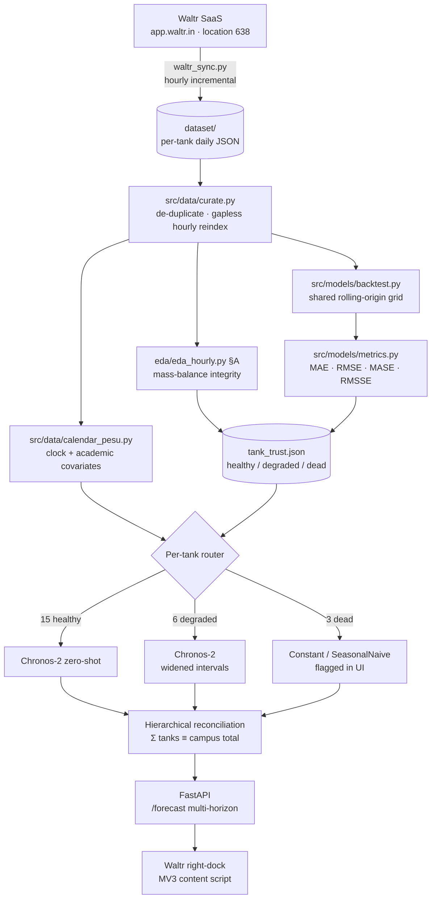

# Forecasting architecture — PESU intelligent water management

Project PW26_PK_06 · 24 tanks · hourly · 2025-01-01 → 2026-04-22

This document describes the forecasting engine that sits behind the Waltr forecast dock, and
justifies each design choice against a measurement rather than a preference.

> **Status note.** §4's evaluation grid (21 origins at a 24-hour stride) was **superseded** before
> the benchmark shipped. The published run used **24 origins at a 23-hour stride** so that every
> hour-of-day is visited exactly once; see [`review_summary.md`](review_summary.md) §2.2 and the
> `README.md` methodology section. Every other section of this document still holds. The
> real-time system built on top of this engine is specified in
> [`realtime_architecture.md`](realtime_architecture.md).

---

## 1. Why the previous design under-delivered

Three concrete problems, all visible in the artefacts already in this repo:

| Problem | Evidence |
|---|---|
| Two duplicate tank directories inflated the panel to 26 series | `results/autogluon` was scored on 624 rows = 26 × 24; the physical campus has 24 tanks |
| Models were never comparable | `results/autogluon` (26 series, 624 rows) vs `results/patchtst` (24 series, 576 rows), different holdout dates |
| Unscaled MAE rewarded broken sensors | `NEW_BLOCK_RO` scores MAE 0.0000 by emitting zero forever; it has no signal at all |

The architecture below fixes all three structurally, not by convention.

---

## 2. Pipeline

---

## 3. Design decisions, and the measurement behind each

### 3.1 Curation is a hard gate, not a convention

`src/data/curate.py` **raises** unless it ends with exactly 24 tanks, zero duplicate
`(item_id, timestamp)` pairs, and a gapless hourly index per tank. The de-duplication is
evidence-based: `GJBC_BLOCK_1_A1_BOY_S` contains all 439 days of `GJBC_BLOCK_1_A1_BOYS` plus 38
more, with identical tank name, dimensions and daily totals.

The gapless reindex changed the picture materially. The previous notebook reported single-digit
missing hours; a true reindex shows:

| Tank | Missing hours | Fully-empty days |
|---|---|---|
| `CRICKET_GROUND_OHT` | 20.7 % | 211 |
| `ME_WORKSHOP_BLOCK` | 19.9 % | 43 |
| `BE_BLOCK_RO` | 10.4 % | — |
| `BE_BLOCK_OHT` | 9.9 % | 24 |

Collapsing those gaps instead of holding them open would shift every later timestamp and destroy
the 24-hour seasonality the model depends on.

### 3.2 A per-tank router, driven by mass balance

The identity `Opening + Inflow − Outflow − Closing = 0` is the most direct sensor test the data
allows, and it had never been run. Judged **relative to each tank's own throughput** (an absolute
threshold would flag every high-flow tank and clear every dead one), it splits the campus:

- **15 healthy** — forecast normally.
- **6 degraded** (`I&H_BLOCK`, `ME_WORKSHOP_BLOCK`, `CRICKET_GROUND_OHT`, `GJBC_BLOCK_1_A4_RO`,
  `IT_BLOCK`, `GJBC_BLOCK_1_A1_BOYS`) — forecast, but widen intervals and surface the caveat.
- **3 dead** (`BE_BLOCK_RO`, `INFORMATION_CENTRE`, `NEW_BLOCK_RO`) — 73–96 % zero hours,
  mean < 0.01 KL/h. No signal exists; a forecast here is theatre. Serve a constant and label it.

The relative criterion is load-bearing, not cosmetic. An absolute 0.1 KL threshold flags
`BE_BLOCK_OHT` on 36 % of hours — but it moves 1.67 KL/h, twenty times a small tank, and
relative to its own throughput its balance error is 0.097, among the **best** on campus. The
absolute threshold was ranking tanks by size, not by sensor quality.

This routing is also why a single global model was always going to look mediocre — three of the
24 series contain no information, and averaging them into a headline number is meaningless.

### 3.3 Covariates were pruned on evidence, and the evidence was surprising

The plan assumed academic-calendar features would dominate long horizons. The horizon-specific
mutual-information study says otherwise:

| Feature | MI @ 6h | MI @ 24h | MI @ 168h |
|---|---|---|---|
| `lag_1` | 0.220 | 0.584 | 0.492 |
| `roll_24` | 0.311 | 0.291 | 0.278 |
| `lag_168` | 0.188 | 0.328 | 0.332 |
| `hour_cos` | 0.045 | 0.084 | 0.083 |
| `exam_proximity` | 0.027 | 0.024 | 0.034 |
| `is_weekend` | 0.006 | 0.003 | 0.004 |
| `is_holiday` | 0.000 | 0.000 | 0.000 |
| `dow_sin` / `dow_cos` | ~0.002 | ~0.003 | ~0.002 |

**Autoregressive structure dominates at every horizon, including 7 days.** Every calendar flag
except `exam_proximity` scores below 0.01 everywhere.

This does *not* contradict the earlier daily-level EDA (weekday 273 KL vs weekend 232 KL,
ANOVA F = 7.7, p < 0.0001). Both are true: the calendar effect is real at **campus-daily**
aggregation and vanishes into noise at **per-tank-hourly** resolution — which is the resolution
the model runs at. Aggregation level, not significance, is what changed.

Consequence: the `Chronos2-COV-LEAN` variant keeps only `hour_sin`, `hour_cos`,
`exam_proximity`. Fewer variates per task means faster inference *and* less noise, and the
benchmark measures whether that trade pays.

### 3.4 Why a foundation model rather than more seasonal statistics

Daily seasonality is weaker than a campus-water intuition suggests — ACF at lag 24 spans
**0.12 (`MRD_BLOCK`) to 0.65 (`GJBC_BLOCK_2_A1`)**, with most tanks between 0.15 and 0.35.
Seasonal methods have little to grip. That is precisely the regime where a pretrained model
that has seen millions of series can beat a hand-specified seasonal decomposition, and it is
why `NPTS` — a nonparametric sampler, not a seasonal model — is the incumbent to beat.

Chronos-2 additionally accepts **past-only covariates** (inflow, opening/closing level), which
Chronos-1 could not. Those channels are observed but unknown ahead, and they are exactly the
signals that describe a refill event.

### 3.5 Hierarchical reconciliation

Campus total is by construction the sum of tanks, but no model in the repo enforces it, so the
"campus demand" number an operator reads is incoherent with the tank numbers beneath it.
Bottom-up aggregation gives coherence for free; MinT is the upgrade path when tank-level
forecast covariances are worth estimating.

---

## 4. Evaluation protocol

One grid, every model, no exceptions — enforced in code by
`backtest.assert_comparable()`, which raises if any two models were scored on different row
counts.

- **21 origins**, spaced 24 h, over a 27-day holdout (`2026-03-26 23:00` → `2026-04-15 23:00`).
- Every origin has a full 168 h of actuals after it.
- **Six horizons**: 6 h, 12 h, 1 d, 2 d, 3 d, 7 d — each a separate forecast call.
- Baselines fit strictly on data **before the first origin**, so no holdout leaks anywhere.

**Metrics.** MAE and RMSE in KL for operational readability; MASE and RMSSE scaled by each
series' own seasonal-naive (m = 24) error for cross-tank comparability. Scales are computed on
pre-origin history only. Series with a zero scale are **excluded and counted**, never
epsilon-patched — `n_tanks_scaled` in every table makes the exclusion visible.

The identity `MASE(SeasonalNaive-24) ≈ 1.0` is asserted in `tests/test_metrics.py`. If that ever
fails, the denominator is wrong and every number in the benchmark is wrong.

---

## 5. What this is, and is not

The engine is a **covariate-conditioned, per-tank-routed Chronos-2** — campus-specific through
its trust routing and its covariate set, not through retrained weights. Calling it a
"campus SLM" would overstate it.

`Chronos2Pipeline.fit()` exists and fine-tuning on PESU history is the natural next step; it was
deferred this round by choice, so that the zero-shot number stands as a clean, reproducible
baseline that a fine-tune must then beat.
