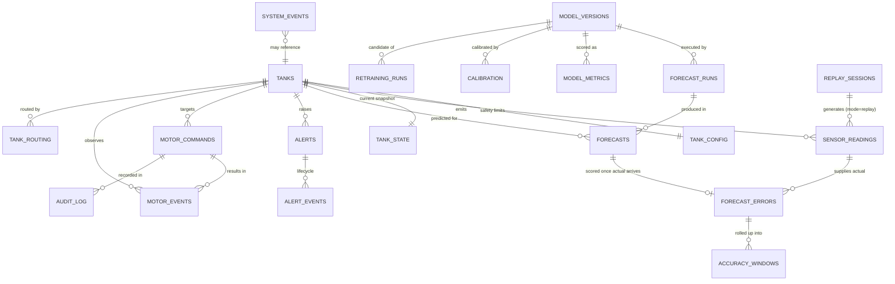

# Data model

**Status: proposed schema. None of these tables exist yet** — the repository currently has no
SQLAlchemy, Alembic or psycopg import anywhere. Postgres is declared in
`extension/deploy/docker-compose.yml` but no code connects to it.

Target: SQLAlchemy 2.x + Alembic. **SQLite** for the demo (single file, no service),
**PostgreSQL 16** for production. The same ORM models run on both; only the driver URL changes.
Types below are given in the portable form with the Postgres form in brackets where they differ.

---

## 0. Two rules that apply to every table

### 0.1 `mode` is on every fact table

```sql
mode TEXT NOT NULL CHECK (mode IN ('replay','live'))
```

Demo rows and live rows share one database and must **never** be aggregated together. Every
query, every rolling metric, every alert dedup key includes `mode`. This is what makes it
structurally impossible to present replayed data as live data.

### 0.2 Missing is never zero

```sql
-- on sensor_readings
CHECK (outflow_kl IS NOT NULL OR quality_flag <> 'ok')
```

A NULL value must carry a non-`ok` quality flag. A zero is a measurement; a NULL is an absence.
The constraint is the schema-level guarantee behind the rule stated in
[`realtime_architecture.md`](realtime_architecture.md) §5.2.

---

## 1. Entity relationships



---

## 2. Reference and configuration

### `tanks`

Static identity. Seeded once from `src.data.curate.tank_metadata()`.

| Column | Type | Notes |
|---|---|---|
| `tank_id` | TEXT PK | Canonical id, e.g. `BE_BLOCK_OHT`. Matches `item_id` throughout `src/` |
| `display_name` | TEXT | `Tank Name` from the source JSON, e.g. `BE BLOCK OHT` |
| `tank_type` | TEXT | `overhead_tank`, `sump`, … |
| `tank_shape` | TEXT | `cuboidal`, `cylindrical` |
| `dimensions_raw` | TEXT | Verbatim `Tank Dimensions` string |
| `geometric_capacity_kl` | REAL | From `capacity_kl()` in `src/models/build_dock_bundle.py` |
| `observed_max_level_kl` | REAL | Max observed `Closing Value in KL`. **Differs from geometric** — `BE_BLOCK_OHT` is 60.21 observed vs 66.39 geometric |
| `observed_min_level_kl` | REAL | Min observed |
| `waltr_tank_id` | TEXT NULL | WALTR's numeric id. NULL until a token lets us fetch `/v1/location/638/tanks` |
| `location_id` | TEXT | `638` for PES University RR |
| `active` | BOOLEAN | |

### `tank_config`

**Every safety threshold lives here, not in code.** Defaults derived from measurement; see
[`safety_and_controls.md`](safety_and_controls.md) §2 for the derivation of each.

| Column | Type | Notes |
|---|---|---|
| `tank_id` | TEXT PK FK→tanks | |
| `level_critical_low_pct` | REAL | Default 10 |
| `level_min_operating_pct` | REAL | Default 20 — motor start threshold |
| `level_target_pct` | REAL | Default 85 — motor stop threshold (hysteresis band with the row above) |
| `level_high_warn_pct` | REAL | Default 92 |
| `level_overflow_pct` | REAL | Default 97 — forced stop |
| `motor_max_runtime_min` | INTEGER | Per-tank, from measured refill run p95 × 1.5 |
| `motor_cooldown_min` | INTEGER | Per-tank, from measured 5th-percentile inter-refill gap |
| `motor_max_starts_per_day` | INTEGER | Per-tank, from measured runs/day × 2 |
| `refill_rate_kl_h` | REAL | Measured median inflow during refill; drives the expected-trajectory verification |
| `stale_threshold_min` | INTEGER | Default 120 |
| `automation_enabled` | BOOLEAN | Per-tank kill switch |
| `min_history_hours` | INTEGER | Default 336. Below this the router refuses to forecast |
| `updated_by`, `updated_at` | TEXT, TIMESTAMP | Every change is audited |

### `tank_routing`

Which forecaster serves which tank, and why.

| Column | Type | Notes |
|---|---|---|
| `tank_id` | TEXT PK FK→tanks | |
| `forecaster` | TEXT | `chronos2` \| `seasonal_naive` \| `constant_zero` \| `none` |
| `reason` | TEXT | Free text, e.g. `trust=dead; constant-zero beats Chronos-2 (MASE 2.06 @ 1d)` |
| `evidence_ref` | TEXT | Path to the artefact justifying it, e.g. `results/chronos2/per_tank_comparison.csv` |
| `widen_intervals` | BOOLEAN | True for `degraded` trust tier |
| `gated` | BOOLEAN | True = designed but not active (the NPTS branch) |

---

## 3. Sensor data

### `sensor_readings`

One row per (tank, hour). Append-mostly. **The durable source of truth**; everything else is
derivable.

| Column | Type | Notes |
|---|---|---|
| `id` | BIGINT PK | |
| `tank_id` | TEXT FK→tanks | |
| `reading_ts` | TIMESTAMP | UTC, hour precision. The measurement time |
| `reading_ts_local` | TIMESTAMP | Original `Asia/Kolkata` value, retained verbatim |
| `ingest_ts` | TIMESTAMP | When the system received it. **Never conflated with `reading_ts`** |
| `inflow_kl` | REAL NULL | |
| `outflow_kl` | REAL NULL | The forecast target |
| `opening_level_kl` | REAL NULL | |
| `closing_level_kl` | REAL NULL | |
| `level_pct` | REAL NULL | Against `observed_max_level_kl` |
| `quality_flag` | TEXT | `ok` \| `missing` \| `stale` \| `duplicate` \| `out_of_order` \| `impossible` \| `balance_breach` \| `spike` \| `sensor_dead` \| `unvalidated` |
| `quality_detail` | JSON NULL | Which rule fired, with the computed value and threshold |
| `mass_balance_residual` | REAL NULL | `opening + inflow − outflow − closing` |
| `source` | TEXT | `replay` \| `waltr` \| `manual` |
| `replay_session_id` | UUID NULL FK | Set only when `mode='replay'` |
| `mode` | TEXT | |
| `correlation_id` | UUID | Follows the causal chain to forecast → decision → command |

**Indexes:** `UNIQUE (tank_id, reading_ts, mode)` (the dedupe guarantee) ·
`(tank_id, reading_ts DESC)` (context window fetch) · `(ingest_ts)` (late-arrival scans) ·
`(quality_flag) WHERE quality_flag <> 'ok'` (partial, for quality dashboards).

**Retention:** indefinite. 24 tanks × 8,760 h ≈ **210 k rows/year** — roughly 20 MB/year. There is
no volume argument for deleting sensor history.

### `tank_state`

Exactly one row per (tank, mode). A **cache**, fully rebuildable from `sensor_readings` +
`forecasts` + `forecast_errors` at startup.

| Column | Type | Notes |
|---|---|---|
| `tank_id` | TEXT | PK with `mode` |
| `mode` | TEXT | |
| `level_kl`, `level_pct` | REAL NULL | |
| `inflow_kl_h`, `outflow_kl_h` | REAL NULL | Latest observed |
| `reading_ts`, `ingest_ts` | TIMESTAMP NULL | |
| `seconds_since_reading` | INTEGER | Computed on read — data freshness |
| `data_status` | TEXT | `fresh` \| `delayed` \| `stale` \| `missing` \| `dead` |
| `quality_flag` | TEXT | Latest |
| `trust_tier` | TEXT | `healthy` \| `degraded` \| `dead`. Seeded from `eda/tank_trust.json` |
| `trust_score` | REAL | Rolling 7-day composite |
| `motor_state` | TEXT | `on` \| `off` \| `unknown`. **`unknown` is the honest default** — no motor telemetry exists |
| `motor_state_origin` | TEXT | `simulated` \| `inferred` \| `real`. Never NULL |
| `motor_command_state` | TEXT | `none` \| `pending` \| `acked` \| `unacked` \| `vetoed` |
| `motor_since` | TIMESTAMP NULL | For runtime-limit enforcement |
| `latest_forecast_run_id` | UUID NULL FK | |
| `next_step_pred`, `next_step_p10`, `next_step_p90` | REAL NULL | |
| `intervals_calibrated` | BOOLEAN | **False until Phase 9 ships** |
| `last_abs_error_kl` | REAL NULL | Most recent scored error |
| `rolling_mae_24h`, `rolling_mae_7d` | REAL NULL | |
| `rolling_mase_24h` | REAL NULL | NULL when the tank's seasonal scale is zero — never epsilon-patched |
| `rolling_bias_24h_pct` | REAL NULL | |
| `interval_coverage_7d` | REAL NULL | Against nominal 0.80 |
| `active_alert_count`, `max_active_severity` | INTEGER, TEXT | |
| `updated_at` | TIMESTAMP | |

**Index:** PK `(tank_id, mode)`.

---

## 4. Forecasting

### `model_versions`

| Column | Type | Notes |
|---|---|---|
| `model_version_id` | UUID PK | |
| `name` | TEXT | `chronos2-zs`, `seasonal-naive-24`, `constant-zero` |
| `model_id` | TEXT NULL | `amazon/chronos-2` |
| `revision` | TEXT NULL | HF revision pin |
| `code_commit` | TEXT | Git SHA of `src/` at activation |
| `context_length` | INTEGER | 2048 for Chronos-2 |
| `quantile_levels` | JSON | `[0.1,0.25,0.5,0.75,0.9]` |
| `device` | TEXT | `mps` \| `cuda` \| `cpu` |
| `status` | TEXT | `candidate` \| `shadow` \| `active` \| `retired` |
| `activated_at`, `retired_at` | TIMESTAMP NULL | |
| `promoted_by`, `promotion_evidence` | TEXT | Link to the `retraining_runs` row that passed the gate |

**Rollback is a status flip on this table** — no redeploy. At most one row per `name` may be
`active`; enforced by a partial unique index.

### `forecast_runs`

One row per inference call batch.

| Column | Type | Notes |
|---|---|---|
| `run_id` | UUID PK | |
| `model_version_id` | UUID FK | |
| `triggered_by` | TEXT | `new_reading` \| `sensor_event` \| `motor_change` \| `anomaly` \| `model_change` \| `manual` \| `scheduled` |
| `origin_ts` | TIMESTAMP | Forecast origin — the last observed hour |
| `horizons` | JSON | `[6,12,24,48,72,168]` |
| `tank_count` | INTEGER | |
| `context_hours` | INTEGER | |
| `latency_ms` | INTEGER | Exported as `forecast_latency_seconds` |
| `status` | TEXT | `ok` \| `partial` \| `failed` |
| `error_detail` | TEXT NULL | |
| `mode`, `correlation_id` | TEXT, UUID | |

**Index:** `(origin_ts DESC)`, `(status) WHERE status <> 'ok'`.

### `forecasts` — the prediction registry

The core table. **Written before a forecast is published**; an unrecordable forecast is not
published and not acted on.

| Column | Type | Notes |
|---|---|---|
| `forecast_id` | BIGINT PK | |
| `run_id` | UUID FK→forecast_runs | |
| `tank_id` | TEXT FK→tanks | |
| `created_at` | TIMESTAMP | When the forecast was made |
| `origin_ts` | TIMESTAMP | Last observed hour used as context |
| `target_ts` | TIMESTAMP | The hour being predicted |
| `horizon_h` | INTEGER | 6 / 12 / 24 / 48 / 72 / 168 |
| `step` | INTEGER | 1..horizon within the forecast |
| `model_version_id` | UUID FK | |
| `pred_kl_h` | REAL | Point forecast, clipped at 0 |
| `p10`, `p25`, `p50`, `p75`, `p90` | REAL | |
| `calibrated` | BOOLEAN | **False until Phase 9.** Drives the "uncalibrated" label in the UI |
| `calibration_id` | UUID NULL FK | |
| `bias_corrected` | BOOLEAN | False until Phase 9 |
| `mode` | TEXT | |

**Indexes:** `UNIQUE (tank_id, origin_ts, horizon_h, target_ts, model_version_id, mode)` ·
`(target_ts, mode)` — the reconciliation lookup, the hottest query · `(tank_id, created_at DESC)`.

**Volume:** at hourly cadence, 24 tanks × (6+12+24+48+72+168) steps = **7,920 rows/hour**
≈ 69 M rows/year. This is the only table with a real retention need.

**Retention:** keep full resolution for 90 days; beyond that keep only rows that have a matching
`forecast_errors` row (i.e. the scored ones), and drop unscored future rows superseded by a later
origin. Partition by month on Postgres.

### `calibration`

Empty until Phase 9. Documented now so the schema does not change later.

| Column | Type | Notes |
|---|---|---|
| `calibration_id` | UUID PK | |
| `model_version_id` | UUID FK | |
| `tank_id` | TEXT FK | |
| `horizon_h` | INTEGER | |
| `method` | TEXT | `split_conformal` |
| `q_lower`, `q_upper` | REAL | Empirical residual quantiles used to widen |
| `volume_bias_factor` | REAL | Multiplicative per-tank correction |
| `fit_window_start`, `fit_window_end` | TIMESTAMP | **Must be disjoint from the coverage-reporting window** |
| `n_residuals` | INTEGER | |
| `achieved_coverage` | REAL NULL | Measured on the *reporting* window, not the fit window |
| `active` | BOOLEAN | |

---

## 5. Accuracy

### `forecast_actuals`

Kept as a distinct table rather than a column on `forecasts` so that a late-arriving or corrected
actual is an insert, not a destructive update.

| Column | Type | Notes |
|---|---|---|
| `forecast_id` | BIGINT PK FK→forecasts | |
| `reading_id` | BIGINT FK→sensor_readings | |
| `actual_kl_h` | REAL NULL | NULL when the actual is missing or fails quality |
| `actual_quality_flag` | TEXT | Copied from the reading |
| `matched_at` | TIMESTAMP | When reconciliation ran |
| `is_late_arrival` | BOOLEAN | |

### `forecast_errors`

| Column | Type | Notes |
|---|---|---|
| `forecast_id` | BIGINT PK FK | |
| `tank_id`, `horizon_h`, `target_ts`, `model_version_id`, `mode` | denormalised | For index-only rollups |
| `error_kl_h` | REAL | `actual − pred` (signed; negative = over-forecast) |
| `abs_error_kl_h` | REAL | |
| `squared_error` | REAL | |
| `scale_mae`, `scale_mse` | REAL NULL | Seasonal-naive denominators from `src.models.metrics.seasonal_scales()`, `m=24`, computed on **pre-origin history only** |
| `scaled_abs_error` | REAL NULL | `abs_error / scale_mae`. **NULL when `scale_mae = 0`** — excluded and counted, never epsilon-patched |
| `inside_p10_p90` | BOOLEAN NULL | Interval coverage indicator |
| `excluded_reason` | TEXT NULL | `no_actual` \| `bad_quality` \| `zero_scale` |

**Indexes:** `(tank_id, horizon_h, target_ts DESC, mode)` · `(model_version_id, target_ts)`.

### `accuracy_windows`

Materialised rollups so the dashboard does not aggregate 69 M rows on every request. Recomputed
on ingest for the affected windows only; always re-derivable from `forecast_errors`.

| Column | Type | Notes |
|---|---|---|
| `id` | BIGINT PK | |
| `scope` | TEXT | `tank` \| `campus` |
| `tank_id` | TEXT NULL | NULL when `scope='campus'` |
| `horizon_h` | INTEGER | |
| `window` | TEXT | `24h` \| `7d` \| `30d` |
| `window_end` | TIMESTAMP | |
| `model_version_id` | UUID FK | |
| `n_scored`, `n_excluded` | INTEGER | `n_excluded` makes exclusions visible, as in the benchmark's `n_tanks_scaled` |
| `mae`, `rmse`, `bias_kl_h`, `bias_pct` | REAL | |
| `mase`, `rmsse` | REAL NULL | NULL when no tank in scope has a usable scale |
| `p10_p90_coverage`, `mean_interval_width` | REAL | Compare against nominal 0.80 |
| `mode` | TEXT | |

**Retention:** `24h` windows 90 days, `7d`/`30d` indefinitely (small).

### `model_metrics`

Point-in-time evaluation records, including the offline benchmark itself, so runtime numbers and
benchmark numbers sit in one comparable place.

| Column | Type | Notes |
|---|---|---|
| `id` | BIGINT PK | |
| `model_version_id` | UUID FK | |
| `evaluation_kind` | TEXT | `benchmark` \| `rolling_runtime` \| `candidate_validation` \| `shadow` |
| `evaluated_at` | TIMESTAMP | |
| `grid_ref` | TEXT | e.g. `24 origins, 23h stride, 2026-03-24..2026-04-15` |
| `horizon_h`, `tank_id` | INTEGER, TEXT NULL | NULL tank = macro |
| `mae`, `rmse`, `mase`, `rmsse`, `coverage`, `volume_bias_pct` | REAL | |
| `rows_evaluated` | INTEGER | Row-parity check, per `assert_comparable()` |
| `source_artifact` | TEXT NULL | e.g. `results/chronos2/metrics_by_horizon.csv` |

---

## 6. Motor

Every row in these tables carries `origin` because **no real motor interface exists**.

### `motor_commands`

| Column | Type | Notes |
|---|---|---|
| `command_id` | UUID PK | |
| `tank_id` | TEXT FK | |
| `idempotency_key` | TEXT | `UNIQUE (tank_id, idempotency_key)` — replay-safe |
| `action` | TEXT | `start` \| `stop` \| `emergency_stop` |
| `requested_at` | TIMESTAMP | |
| `requested_by` | TEXT | Principal (`system:decision_engine` or a user `sub`) |
| `authority` | TEXT | `automatic` \| `operator` \| `emergency` |
| `origin` | TEXT | `simulated` \| `real`. **`simulated` in the demo, always** |
| `reason` | TEXT | Human-readable: `projected level 12% below min in 4h` |
| `driving_forecast_id` | BIGINT NULL FK | Which prediction motivated it. NULL for pure safety actions |
| `safety_gate_result` | TEXT | `approved` \| `clamped` \| `vetoed` |
| `safety_gate_detail` | JSON | Which checks ran, which fired, with values and thresholds |
| `expires_at` | TIMESTAMP | TTL. Past this, unacked ⇒ assumed **not** applied |
| `ack_state` | TEXT | `pending` \| `acked` \| `unacked` \| `superseded` |
| `acked_at` | TIMESTAMP NULL | |
| `mode`, `correlation_id` | TEXT, UUID | |

**Indexes:** `UNIQUE (tank_id, idempotency_key)` · `(tank_id, requested_at DESC)` ·
`(ack_state) WHERE ack_state = 'pending'`.

### `motor_events`

Observed motor activity, whether commanded or not.

| Column | Type | Notes |
|---|---|---|
| `event_id` | BIGINT PK | |
| `tank_id` | TEXT FK | |
| `event_ts` | TIMESTAMP | |
| `event_type` | TEXT | `started` \| `stopped` \| `running` \| `no_response` \| `runtime_exceeded` \| `short_cycle` |
| `origin` | TEXT | `simulated` \| **`inferred`** \| `real` |
| `inference_basis` | TEXT NULL | For `inferred`: `Inflow in KL > 0.05 for >= 1h`. Measured basis: refill runs occur 0.02–4.15 times/day per tank with 1.3–4.5 h mean length |
| `command_id` | UUID NULL FK | NULL when the event was not commanded by us |
| `level_at_event_kl` | REAL NULL | |
| `expected_level_delta_kl` | REAL NULL | From `tank_config.refill_rate_kl_h` — drives verification |
| `observed_level_delta_kl` | REAL NULL | |
| `verified` | BOOLEAN NULL | NULL until enough readings arrive |
| `mode` | TEXT | |

**Index:** `(tank_id, event_ts DESC)`.

---

## 7. Alerts

### `alerts`

One row per *active condition*, not per occurrence. This is what makes dedup structural.

| Column | Type | Notes |
|---|---|---|
| `alert_id` | UUID PK | |
| `dedup_key` | TEXT | `{tank_id}:{event_type}:{mode}`. **Partial unique index while state is open** |
| `tank_id` | TEXT NULL FK | NULL for system-scope alerts |
| `category` | TEXT | `data` \| `forecast` \| `tank` \| `motor` \| `model` \| `system` |
| `event_type` | TEXT | e.g. `tank.approaching_minimum` |
| `severity` | TEXT | `info` \| `warning` \| `critical` |
| `state` | TEXT | `active` \| `escalated` \| `acknowledged` \| `resolved` \| `expired` |
| `first_seen_at`, `last_seen_at` | TIMESTAMP | |
| `occurrence_count` | INTEGER | Incremented instead of inserting duplicates |
| `message` | TEXT | |
| `current_value`, `threshold_value` | REAL NULL | Both required for any threshold alert |
| `predicted_value` | REAL NULL | When the alert is forecast-driven |
| `forecast_id` | BIGINT NULL FK | |
| `recommended_action` | TEXT | |
| `automation_acted` | BOOLEAN | Whether the system did something, or only advised |
| `command_id` | UUID NULL FK | |
| `acknowledged_by`, `acknowledged_at` | TEXT, TIMESTAMP NULL | |
| `resolved_at`, `resolution` | TIMESTAMP NULL, TEXT | `auto_cleared` \| `operator_resolved` \| `expired` |
| `mode`, `correlation_id` | TEXT, UUID | |

**Indexes:** `UNIQUE (dedup_key) WHERE state IN ('active','escalated')` — the dedup guarantee ·
`(state, severity, last_seen_at DESC)` — the alert panel query · `(tank_id, first_seen_at DESC)`.

### `alert_events`

Append-only lifecycle trail: `raised` → `suppressed` → `escalated` → `acknowledged` → `resolved`,
each with timestamp, actor and the values at that moment. Never updated.

**Retention:** alerts 1 year; `alert_events` 1 year, then archived.

---

## 8. Model lifecycle and system

### `retraining_runs`

| Column | Type | Notes |
|---|---|---|
| `run_id` | UUID PK | |
| `kind` | TEXT | `recalibration` \| `re_evaluation` \| `fine_tune` |
| `trigger` | TEXT | `scheduled` \| `error_drift` \| `coverage_drift` \| `data_drift` \| `manual` |
| `candidate_model_version_id` | UUID NULL FK | |
| `baseline_model_version_id` | UUID FK | The incumbent it must beat |
| `started_at`, `finished_at` | TIMESTAMP | |
| `status` | TEXT | `running` \| `succeeded` \| `failed` \| `rejected` \| `promoted` |
| `validation_grid` | JSON | origins, stride, horizons, row counts per model |
| `row_parity_ok` | BOOLEAN | From `assert_comparable()`. **False ⇒ automatic rejection** |
| `gate_result` | JSON | Per-criterion pass/fail: MASE win, coverage not worse, no per-tank regression > 10 % |
| `rejection_reason` | TEXT NULL | |
| `log_path` | TEXT | |

### `system_events`

Every non-alert operational fact: service start/stop, source connect/disconnect, config change,
cache rebuild, schema migration, replay session lifecycle. Columns: `event_ts`, `component`,
`event_type`, `severity`, `detail JSON`, `correlation_id`, `mode`.

**Retention:** 90 days, then rotated.

### `audit_log`

Append-only, **never deleted**, separate from `system_events` because it is a compliance record
rather than a diagnostic one. Every motor command, every config change, every manual override,
every e-stop, every model promotion, every role grant.

| Column | Type | Notes |
|---|---|---|
| `id` | BIGINT PK | |
| `occurred_at` | TIMESTAMP | |
| `actor` | TEXT | JWT `sub`, or `system:<component>` |
| `actor_role` | TEXT | `viewer` \| `operator` \| `admin` \| `system` |
| `action` | TEXT | `motor.start`, `config.update`, `model.promote`, `override.engage`, … |
| `target_type`, `target_id` | TEXT | |
| `before`, `after` | JSON NULL | Config changes record both |
| `justification` | TEXT NULL | Required for manual override and e-stop reset |
| `request_ip`, `user_agent` | TEXT NULL | |
| `mode` | TEXT | |

**Index:** `(occurred_at DESC)`, `(actor, occurred_at DESC)`, `(action, occurred_at DESC)`.

### `replay_sessions`

| Column | Type | Notes |
|---|---|---|
| `session_id` | UUID PK | |
| `created_by`, `created_at` | TEXT, TIMESTAMP | |
| `scenario_id` | TEXT NULL | FK to the mined scenario index — see [`demo_plan.md`](demo_plan.md) §3 |
| `tank_scope` | JSON | Tank ids, or `all` |
| `sim_start_ts`, `sim_end_ts` | TIMESTAMP | Range of historical time being replayed |
| `sim_current_ts` | TIMESTAMP | Where the virtual clock is now |
| `speed` | REAL | 1, 10, 60, or custom |
| `state` | TEXT | `created` \| `running` \| `paused` \| `finished` \| `aborted` |
| `horizons` | JSON | |

**On session delete, all `mode='replay'` rows carrying that `session_id` are deleted with it** —
demo data is disposable by construction and cannot accumulate into the live record.

---

## 9. Retention summary

| Table | Growth | Retention |
|---|---|---|
| `sensor_readings` | ~210 k rows/yr | Indefinite (~20 MB/yr) |
| `forecasts` | ~69 M rows/yr at hourly cadence | 90 d full; then scored rows only; monthly partitions |
| `forecast_errors` | ~69 M rows/yr | 1 year, then aggregate into `accuracy_windows` and drop |
| `accuracy_windows` | ~1.3 M rows/yr | `24h` 90 d; `7d`/`30d` indefinite |
| `alerts` / `alert_events` | small | 1 year |
| `motor_commands` / `motor_events` | small | Indefinite (audit value) |
| `system_events` | moderate | 90 days |
| `audit_log` | small | **Never deleted** |
| `mode='replay'` rows | bounded by session | Deleted with the session |

The `forecasts` table is the only one where retention is an engineering concern. If storage
becomes a constraint before Phase 9, the first lever is reducing stored steps for the 168 h
horizon (keep every hour for h ≤ 48, every 6th hour beyond) — a change that costs nothing in the
UI, which never plots 168 hourly points at full density.
