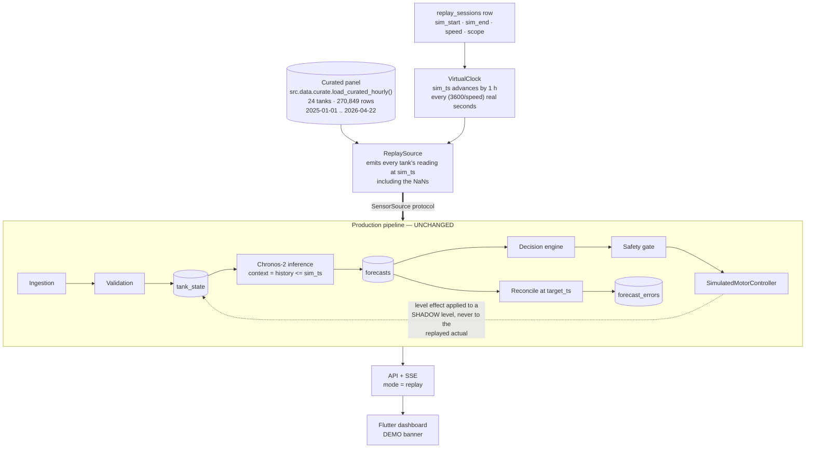
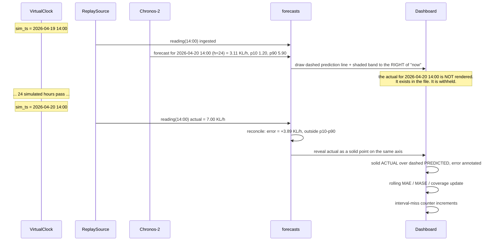

# Demo plan — historical replay

**Status: proposed. The replay engine does not exist yet.**

The demo runs the complete real-time system against the dataset the Chronos-2 benchmark was
evaluated on, replayed as if it were arriving now. Everything downstream of the data source is
the production pipeline, unmodified.

**The demo never claims to be live.** Mode is a first-class field in the schema, in every API
response, in every SSE event, and in a persistent UI banner.

---

## 1. What is real and what is not

| Element | Status in the demo |
|---|---|
| Tank readings (inflow, outflow, opening, closing levels) | **Real historical measurements** from `dataset/`, replayed in order |
| Forecasts | **Real Chronos-2 inference**, computed live during the replay from the context available at that simulated moment. Not precomputed, not replayed |
| Prediction errors, MAE / MASE / coverage | **Really computed** from those live forecasts against the real actuals |
| Sensor degradation, missing data, anomalies | **Real events** from the historical record (§3) |
| Tank levels and capacities | **Real**, from the record and from `Tank Dimensions` |
| Refill events in history | **INFERRED** from `Inflow in KL > 0.05` — labelled, never presented as motor telemetry |
| Motor commands and responses | **SIMULATED** — no motor interface exists |
| WALTR connection | **Absent.** No token is available |

Only two things are synthetic: the motor, and the passage of time. Both are labelled.

---

## 2. Replay architecture



### 2.1 The leakage guarantee

The single rule that makes the demo honest: **at simulated time `T`, no component may read any
row whose `reading_ts > T`.**

Enforced three ways:

1. `ReplaySource` emits strictly in `sim_ts` order and holds nothing ahead.
2. The history service filters context with `history_before(panel, sim_ts, context)` — the same
   function `src/models/backtest.py` uses to guarantee no leakage in the benchmark.
3. A test asserts that for every forecast produced during a replay,
   `max(context.timestamp) <= origin_ts < min(target_ts)`. This mirrors the benchmark's
   `timestamp > origin` assertion, which is why it is trustworthy.

### 2.2 The shadow-level problem, and how it is handled

A simulated motor that adds water to a tank would contradict the recorded level for the next hour.
Two modes, selectable per session:

* **Observation mode (default).** Simulated motor commands are recorded and displayed, but the
  tank level continues to follow the historical record. The UI shows both the command and the
  historically observed refill, and the panel explains that the recorded refill is what the real
  automation did. This is the honest mode and the one used for accuracy claims.
* **Counterfactual mode.** The simulated motor drives a *shadow* level series alongside the real
  one, using `tank_config.refill_rate_kl_h` and the real outflow. Both are plotted; the shadow is
  drawn dashed and labelled `SIMULATED — counterfactual`. Useful for demonstrating the safety
  gate. **No accuracy metric is ever computed against the shadow series.**

### 2.3 Speed and cost

`sim_ts` advances one hour every `3600 / speed` real seconds.

| Speed | 1 sim-hour takes | 24 sim-hours take | Inference load |
|---|---|---|---|
| 1× | 60 min | 24 h | trivial |
| 10× | 6 min | 2.4 h | trivial |
| 60× | 60 s | 24 min | ~4 s GPU per 60 s wall clock |
| 300× | 12 s | 5 min | inference becomes the bottleneck |

The cost basis: the benchmark measured **89 s for 144 batched (origin × horizon) calls across all
24 tanks** — ~0.6 s per call for the whole fleet. One simulated hour needs 6 calls ≈ 4 s. So 60×
runs comfortably; beyond ~500× the pipeline must either drop horizons or batch simulated hours,
and the UI says so rather than silently skipping forecasts.

---

## 3. Scenario index — mined from the real record

Scenarios are **found, not fabricated**. A Phase 2 script scans the curated panel and writes
`realtime/scenarios.json`; the values below were measured during the architecture audit and are
what that script should reproduce.

### 3.1 Peak demand

| Scenario | Tank | Window | Measured |
|---|---|---|---|
| Campus peak | `MRD_BLOCK` | 2026-04-01 → 2026-04-03 | 24 h demand peaks at **101.1 KL** vs a 2026 median of 29.0 KL — a 3.5× spike |
| Sustained high | `BE_BLOCK_OHT` | 2026-03-26 → 2026-03-28 | 24 h demand **75.9 KL** vs median 42.1 KL |
| Exam-block demand | `GJBC_LAW_BLOCK_3_A4_BOYS` | 2026-04-12 → 2026-04-14 | 24 h demand **43.9 KL** vs median 27.5 KL; overlaps the ISA window beginning 2026-04-27 in `src/data/calendar_pesu.py` |

These are the scenarios where the measured **−12.15 % volume under-forecast** matters most, and
the demo should show it happening rather than hide it.

### 3.2 Low demand

| Scenario | Tank | Window | Measured |
|---|---|---|---|
| Holiday trough | `MRD_BLOCK` | 2026-01-26 | 24 h demand **0.0 KL** — Republic Day, present in `HOLIDAYS` |
| Low-draw week | `BE_BLOCK_OHT` | 2026-01-11 | 24 h demand **6.1 KL** vs median 42.1 KL |

### 3.3 Sensor degradation and missing data

| Scenario | Tank | Window | Measured |
|---|---|---|---|
| **Campus-wide outage** | all 24 tanks | 2026-03-25 13:00 → 23:00 | **All 24 tanks lose data simultaneously for 11 hours.** The single best demonstration of `system.source_lost`, fail-safe behaviour and recovery |
| Extended sensor failure | `ME_WORKSHOP_BLOCK` | 2026-02-13 17:00 + 142 h | A **142-hour** continuous gap; 376 missing hours across 2026. Drives trust tier `healthy → degraded` |
| Long single-tank gap | `CRICKET_GROUND_OHT` | 2026-02-01 06:00 + 49 h | 49-hour gap; the tank has 20.7 % missing hours and 211 fully-empty days overall |
| Short gap | `MM_BLOCK` | 2026-02-27 18:00 + 19 h | 19-hour gap on an otherwise healthy tank — recovery path |

The campus-wide 2026-03-25 outage is the centrepiece: it is real, it is unambiguous, it affects
every tank at once, and it exercises the whole degradation matrix in one pass.

### 3.4 Threshold approach and refill

| Scenario | Tank | Window | Measured |
|---|---|---|---|
| **Deep drawdown → refill** | `BE_BLOCK_OHT` | 2026-04-20 00:00 → 23:00 | Level falls 22.83 → **5.00 KL (8.3 % of observed max)** by 16:00, then two inferred refill runs (05:00–08:00 and 17:00–23:00) restore it to 26.87 KL. A complete approach-minimum → refill → recover cycle in one real day |
| Critical low | `BE_BLOCK_OHT` | 2026-01-21 03:00 | Level reaches **0.5 %** of observed max. 96 hours below 10 % across 2026 |
| Repeated low | `G_BLOCK` | 2026-01-09 05:00 | Minimum 14.9 %; **236 hours below 20 %** across 2026 |
| Frequent cycling | `MM_BLOCK` | any week | **4.15 refill runs/day** — the highest on campus. Exercises `motor.cycling_too_frequently` |

### 3.5 Model weakness — shown, not hidden

| Scenario | Tank | Why |
|---|---|---|
| Hard tank | `GJBC_LAW_BLOCK_3__A1` | Healthy sensor, MASE **1.52 at 1 d** — worse than seasonal naive. A genuine modelling failure, and the demo shows the wide intervals and large errors honestly |
| Degenerate tank | `INFORMATION_CENTRE` | 91.9 % zero hours, MASE **2.06**. The router serves a constant and the UI shows a no-signal state instead of a forecast |
| Tank the model loses | `NBX` | Chronos-2 is 2.4 % worse than NPTS at 1 d. Demonstrates why the NPTS router branch is gated rather than shipped |

**The demo must include §3.5.** A demonstration that only shows the wins is not a demonstration of
this system; it is a demonstration of a subset of the data.

---

## 4. The actual-vs-predicted reveal

The mechanic that makes replay worth doing:



Rendering rules:

* **Actual** — solid line, full-opacity, only ever drawn left of the `now` marker.
* **Predicted** — dashed, only ever drawn right of the `now` marker at the time it was made; once
  revealed, the *retrospective* prediction is drawn as a light dashed overlay on the actual so the
  two can be compared at the same instant.
* **p10–p90** — shaded band, always carrying the label
  *"uncalibrated · measured coverage 72 %, nominal 80 %"*.
* **Future region** — hatched background, so "no data here yet" is visually obvious.
* The `now` marker is `sim_ts`, labelled with the simulated timestamp, never the wall clock.

### 4.1 Metrics shown

| Shown | Not shown |
|---|---|
| Current value (KL/h, KL) | "Accuracy %" — MASE is a ratio, not a percentage |
| Predicted value with p10/p90 | Any single campus accuracy figure |
| Actual value once revealed | Percentage volume error for tanks under 1 KL per 24 h (6 tanks fail this test) |
| Absolute error (KL/h) | Metrics computed against the counterfactual shadow level |
| Rolling MAE, 24 h / 7 d | |
| MASE with the 1.0 reference marked | |
| RMSE, RMSSE | |
| Signed bias, with the measured −12.15 % pooled 24 h bias called out | |
| Interval coverage vs nominal 0.80 | |
| `n_excluded` alongside every rolled-up metric | |

---

## 5. Dashboard layout

Flutter Web, theme ported from `capsem6/extension/tokens.css`; the four existing designed pages
(`ForecastMain`, `ForecastDetail`, `ForecastAnomaly`, `ForecastAdmin` in `pages.jsx`) are the
visual reference.

**Persistent header banner** in demo mode:

```
▶ DEMO — HISTORICAL REPLAY   ·   simulated time 2026-04-20 16:00   ·   60×   ·   NOT LIVE DATA
```

Amber, always visible, not dismissible. In live mode it is replaced by a neutral
`● LIVE · last update 4 min ago`.

### 5.1 Global view

Total tanks · tanks needing attention · active warnings · active criticals · motors running
(badged `SIMULATED`) · model health · calibration status (`uncalibrated` until Phase 9) · campus
24 h demand actual vs predicted · a 24-tank grid where each cell shows level %, data status and
the highest active severity.

### 5.2 Tank view

Level and capacity (both observed operating max and geometric, since they differ) · current
outflow · predicted requirement for the selected horizon · actual once revealed · the
actual-vs-predicted chart with uncertainty band · sensor health (freshness, trust tier,
missing/zero %, mass-balance residual) · forecast health (rolling MAE/MASE, this tank's benchmark
MASE for reference) · motor state and recommendation · recent alerts.

### 5.3 Provenance rendering

Non-negotiable, and the reason the API carries a `provenance` discriminator on every value:

| State | Rendering |
|---|---|
| `ACTUAL` | Solid, full opacity, no badge |
| `PREDICTED` / `FORECAST` | Dashed line, italic numerals, `~` prefix, "predicted" chip |
| `UNCERTAIN` | Predicted styling + widened band + amber confidence chip |
| `INFERRED` | Dotted, violet `INFERRED` chip with a tooltip naming the basis (`Inflow > 0.05 KL/h`) |
| `SIMULATED` | Violet `SIMULATED` chip, hatched fill |
| `STALE` | Greyed, reduced opacity, with the age (`14 min old`) |
| `UNAVAILABLE` | Em-dash `—` with a "no data" chip. **Never `0`, never a blank that could read as zero** |

### 5.4 Replay controls

Scenario picker (the mined index, each entry naming its measured basis) · tank scope · start date
· speed (1× / 10× / 60× / custom) · horizon · `▶ START` `⏸ PAUSE` `⏭ SEEK` · a timeline showing
simulated position within the session · a session-delete control whose confirmation states that
all `mode='replay'` rows will be removed with it.

---

## 6. Walkthrough — the 2026-04-20 `BE_BLOCK_OHT` day

A single real day that exercises nearly the whole system.

| Sim time | Event | Severity | System behaviour |
|---|---|---|---|
| 00:00 | Level 22.83 KL (37.9 %), steady draw ~1.6 KL/h | INFO | Forecast generated for all six horizons |
| 05:00 | Inflow 5.31 KL — refill begins | INFO | `motor.started` (`origin: inferred`). Forecast regenerated on the motor-state trigger |
| 08:00 | Level 31.06 KL (51.6 %); inflow tapers | INFO | `motor.stopped` (inferred). Run length 3 h, within the 10 h p95 |
| 14:00 | Outflow spikes to **7.00 KL/h** against a 3.11 KL/h prediction | WARNING | `forecast.prediction_error_high`; the actual falls **outside p10–p90** — a visible demonstration of the 72 % coverage problem |
| 16:00 | Level **5.00 KL = 8.3 %**, below `level_critical_low_pct` (10 %) | **CRITICAL** | `tank.below_minimum`. Decision engine proposes a refill **regardless of forecast** |
| 16:00 | Safety gate evaluates | — | Freshness ✅ · trust `healthy` ✅ · overflow ✅ · cooldown 8 h since last stop vs 180 min ✅ · start budget 1 of 4 ✅ → **approved**, runtime clamped to the 240 min cap |
| 17:00 | Inflow 4.28 KL — refill begins | INFO | `motor.started` (inferred, matching the simulated command) |
| 17:00–23:00 | Level recovers 5.00 → 26.87 KL | INFO | Verification: expected `4.81 KL/h × 6 h = 28.9 KL`, observed 21.9 KL — within the ±50 % tolerance, `verified = true` |
| 23:00 | Level 26.87 KL (44.6 %) | RESOLVED | `tank.below_minimum` auto-resolves on an observed reading above threshold |

Every number in that table is from the real record. The only simulated element is the command at
16:00, and it is labelled.

---

## 7. What changes when WALTR access arrives

```
today:      SOURCE=replay  MOTOR=simulated  CLOCK=virtual  MODE=replay
with token: SOURCE=waltr   MOTOR=simulated  CLOCK=real     MODE=live   WALTR_SERVICE_TOKEN=...
```

**Changes:** one adapter implementation (`WaltrPollSource` over the existing
`extension/api/app/waltr_sync.py`), two settings values, one credential. `/replay/*` starts
returning 404. The banner switches from amber DEMO to neutral LIVE.

**Does not change:** the schema, the pipeline, the API contract, the SSE event types, the Flutter
UI, the decision engine, the safety gate, the alert taxonomy.

**Still simulated after a token arrives:** the motor. A WALTR data token grants read access to
tank readings. It does not create a motor-control API, and none exists. Motor `origin` stays
`simulated` until the staged rollout in [`safety_and_controls.md`](safety_and_controls.md) §9
completes.

### 7.1 Known gaps in the live path

* **No working token today.** `WaltrPollSource` cannot be tested end-to-end until one is issued.
* **The available endpoint is a daily CSV**, `GET /v1/tank/{id}/flow/daily/csv/{date}`. It is a
  poll, not a push. Latency to a new hourly reading depends on how quickly WALTR publishes it,
  which is **unmeasured**. The poll adapter is written against that endpoint with a documented
  upgrade path to a push/stream API should one appear.
* **Open items with the WALTR team** (JWKS URL, `iss`/`aud`, role claim key, service-token
  issuance and rotation) are listed in `extension/docs/integration-waltr.md` §7 and are all still
  unresolved.
* **Timezone.** Source timestamps are hour-precision local (`"2026-04-22 00"`). The live adapter
  must confirm the intended zone with WALTR rather than assume `Asia/Kolkata`.

---

## 8. Demo acceptance criteria

The demo is ready when, without any manual intervention:

1. Selecting the 2026-03-25 campus-outage scenario at 60× produces `system.source_lost`, moves all
   24 tanks to `stale`, disables automated motor starts, and recovers cleanly at 2026-03-26 00:00.
2. Selecting the 2026-04-20 `BE_BLOCK_OHT` scenario reproduces the §6 walkthrough end to end.
3. The actual-vs-predicted chart never renders an actual before its simulated time arrives, and
   the leakage test in §2.1 passes.
4. Rolling MASE computed live during a replay over the benchmark's holdout window lands within
   **±0.05** of the published `metrics_by_horizon.csv` value for the same horizon — a direct check
   that the runtime path and the benchmark path compute the same thing.
5. Every simulated or inferred value on screen carries its badge, verified by inspection against
   the §5.3 table.
6. Deleting a replay session removes every row it created, leaving no `mode='replay'` residue.
