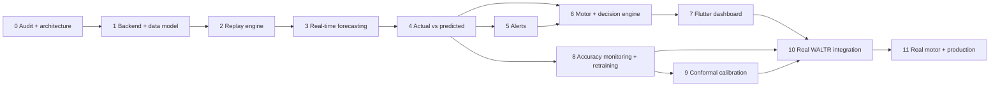

# Implementation plan

Phased delivery of the system specified in [`realtime_architecture.md`](realtime_architecture.md).

**Non-negotiable constraints across every phase:**

* The Chronos-2 benchmark is complete. **Nothing under `results/`, `dataset/` or `eda/` is
  modified.** `src/` is imported, not edited, except for additive helpers that leave existing
  function signatures untouched — and `tests/test_metrics.py` must still pass 6/6 after any such
  addition.
* PatchTST is out of scope.
* No expensive re-run of the benchmark. The one permitted re-execution is
  `python -m src.models.score_benchmark --strict` (~7 s from existing predictions) as a regression
  check that `src/` was not disturbed.

**Code location:** a new `realtime/` package inside `Capstone/`. `extension/api/` and
`extension/web/` are frozen as reference; `extension/waltr-dock/` remains as the standalone
offline demo.

---

## Dependency graph



No phase depends on a later one. Phases 5 and 6 may proceed in parallel after 4. Phase 8 may
proceed in parallel with 5–7.

| Phase | Complexity | Sessions (est.) | Blocked by |
|---|---|---|---|
| 0 Audit + architecture | S | 1 | — |
| 1 Backend + data model | M | 2–3 | — |
| 2 Replay engine | M | 2 | 1 |
| 3 Real-time forecasting | M | 2 | 2 |
| 4 Actual vs predicted | M | 2 | 3 |
| 5 Alerts | M | 2 | 4 |
| 6 Motor + decision engine | **L** | 3–4 | 4, 5 |
| 7 Flutter dashboard | **L** | 4–5 | 6 |
| 8 Accuracy monitoring + retraining | M | 2–3 | 4 |
| 9 Conformal calibration | M | 2 | 8 |
| 10 Real WALTR integration | M | 2 | **an issued WALTR token** |
| 11 Real motor + production | **L** | 4+ | **a motor-control API that does not exist** |

---

## Phase 0 — Repository audit and architecture

**Objective.** Establish what exists, what does not, and what the system should be, before any
code is written.

**Deliverables.** `docs/realtime_architecture.md`, `docs/implementation_plan.md` (this file),
`docs/api_design.md`, `docs/data_model.md`, `docs/demo_plan.md`,
`docs/safety_and_controls.md`, a README section, and a staleness note on `docs/architecture.md`.

**Tests.** Every Mermaid block renders. Every quoted figure traces to `results/chronos2/`, `eda/`,
or a statistic recomputed from `src.data.curate.load_curated_hourly()`.

**Acceptance.** `git status` shows changes only under `docs/` and `README.md`. No forbidden claim
(live WALTR, real motor, implemented calibration) survives a grep.

**Risk.** Documenting an architecture that does not survive contact with implementation.
*Mitigation:* the four protocols in §2 of the architecture are the only load-bearing commitment;
everything else is revisable.

**Status: this phase is complete.**

---

## Phase 1 — Real-time backend and data model

**Objective.** A FastAPI service with a persistent schema, the four protocols, and configuration —
running but with no data source attached.

**Create:**

```
realtime/
  __init__.py
  config.py              # pydantic-settings; SOURCE, MOTOR, CLOCK, MODE, DB URL, thresholds
  protocols.py           # Clock, SensorSource, MotorController, Forecaster + dataclasses
  db/
    base.py              # SQLAlchemy 2.x engine/session, SQLite + Postgres
    models.py            # every table in docs/data_model.md
    migrations/          # Alembic; 0001_baseline
    seed.py              # tanks + tank_config from curate.tank_metadata() and eda/tank_trust.json
  ingestion/
    service.py           # normalise, dedupe, watermark, ingest_ts
    validation.py        # the quality rules table
    quality.py           # trust scoring, rolling tiers
  state/
    store.py             # tank_state upsert + rebuild-from-source
  api/
    main.py              # app factory; reuses the HMAC middleware pattern from extension/api
    deps.py              # auth, role gates, session
    routes/              # tanks, state, readings, system
    schemas.py           # pydantic models incl. the provenance discriminator
    events.py            # SSE broker + ring buffer
  clock.py               # RealClock, VirtualClock
  tests/
```

**Reuse:** `src.data.curate.tank_metadata()` and `load_curated_hourly()` for seeding;
`src.models.build_dock_bundle.capacity_kl()` for geometric capacity;
`extension/api/app/auth.py` as the HMAC/role pattern; `extension/api/app/config.py` as the
settings pattern.

**Tests.**
* Unit: each quality rule against handcrafted rows (missing, duplicate, out-of-order, negative,
  over-capacity, balance breach, spike).
* **Property: a NULL reading never becomes 0** — through ingestion, storage, state and API
  serialisation. Asserted at all four layers.
* Constraint: `UNIQUE (tank_id, reading_ts, mode)` rejects a duplicate;
  `CHECK (value IS NOT NULL OR quality_flag <> 'ok')` rejects a silent NULL.
* Integration: seed → 24 tanks and 24 `tank_config` rows present; `GET /state` returns 24 tanks.
* Migration: `alembic upgrade head` then `downgrade base` is clean on SQLite and Postgres.

**Acceptance.** Service starts with no source attached. `GET /system/health` returns 200.
`GET /state` returns 24 tanks with `data_status: "missing"` and `level: null` — **not zero**.
`python -m tests.test_metrics` still passes 6/6.

**Risks.** *SQLite/Postgres divergence* (partial indexes, JSON types) — mitigate by running the
migration test on both from day one. *Schema churn later* — mitigate by including the Phase 9
`calibration` and Phase 11 motor columns in the baseline now, unused.

---

## Phase 2 — Historical replay engine

**Objective.** A replayable sensor stream that is indistinguishable to downstream code from a live
one, plus a scenario index mined from the real record.

**Create:** `realtime/sources/replay.py` · `realtime/sources/registry.py` ·
`realtime/replay/session.py` · `realtime/replay/scenarios.py` (the miner) ·
`realtime/scenarios.json` (generated) · `realtime/api/routes/replay.py`.

**Reuse:** `src.data.curate.load_curated_hourly()` (loaded once, held in memory — 270,849 rows is
~30 MB); `src.models.backtest.history_before()` for context truncation.

**The scenario miner** scans the panel for the categories in [`demo_plan.md`](demo_plan.md) §3 and
must reproduce the measured windows recorded there (campus-wide 11 h outage on 2026-03-25 13:00;
`ME_WORKSHOP_BLOCK` 142 h gap from 2026-02-13 17:00; `MRD_BLOCK` 101.1 KL peak on 2026-04-02;
`BE_BLOCK_OHT` drawdown to 8.3 % on 2026-04-20 16:00).

**Tests.**
* **Leakage: for every emitted reading, `reading_ts <= sim_ts`.** The property the whole demo rests on.
* Determinism: the same session config replayed twice produces byte-identical readings.
* Speed: at 60×, `sim_ts` advances 60 ± 2 simulated hours per real hour.
* Transport: pause/resume/seek leave `sim_current_ts` consistent.
* Miner: regenerating `scenarios.json` reproduces the documented windows exactly.
* Teardown: deleting a session removes every `mode='replay'` row it created.

**Acceptance.** A 60× session over 2026-03-24 → 2026-04-22 (the benchmark holdout) runs to
completion, ingests every reading including NaNs, and leaves no leakage-test failure.

**Risks.** *Wall-clock drift at high speed* — the virtual clock is computed from elapsed real time,
never accumulated by addition. *Memory* — one panel copy shared across sessions, read-only.

---

## Phase 3 — Chronos-2 real-time forecasting

**Objective.** Live inference on the replay stream, with the cadence policy and persistence.

**Create:** `realtime/forecasting/chronos2.py` (wraps
`src.models.chronos2_forecasting.forecast_one`, warm pipeline) ·
`realtime/forecasting/fallback.py` (seasonal-naive via `src.models.backtest`, constant-zero) ·
`realtime/forecasting/router.py` · `realtime/forecasting/scheduler.py` (APScheduler + debounce) ·
`realtime/forecasting/service.py` · `realtime/api/routes/forecast.py`.

**Router at this phase:** dead tanks → constant-zero; history < 336 h or stale → no forecast;
everything else → Chronos-2. **The NPTS branch is written but `gated = true` and unreachable.**

**Tests.**
* Warm-pipeline: first call loads the model; subsequent calls do not.
* Debounce: two triggers within one data-hour produce one inference.
* Trigger coverage: each of the six triggers fires exactly once in a scripted sequence.
* Fallback: with the pipeline forced to raise, a seasonal-naive forecast is produced and flagged
  `degraded_model`, and `model.unavailable` is raised.
* Persistence: every forecast row is written **before** the SSE event is emitted.
* **Parity: a forecast produced by the runtime path for a given origin matches
  `forecast_one()` called directly with the same context, to floating-point tolerance.** This is
  what proves the runtime is running the benchmarked model and not a variant of it.

**Acceptance.** A 60× replay over the holdout window produces forecasts at all six horizons for
every non-dead tank, p95 latency under 30 s per tick, no gaps in `forecast_runs`.

**Risks.** *Inference slower than replay* — measured basis is ~0.6 s/call for the whole fleet, so
60× has ~15× headroom; the scheduler drops to the longest horizons first and emits
`forecast.skipped` rather than silently falling behind. *Model download at startup* — pin the
revision and fail loudly if unavailable.

---

## Phase 4 — Actual-vs-predicted tracking

**Objective.** The prediction registry closes its loop: every forecast is scored against reality.

**Create:** `realtime/accuracy/reconcile.py` · `realtime/accuracy/errors.py` (wraps
`src.models.metrics`) · `realtime/accuracy/windows.py` · `realtime/api/routes/accuracy.py`.

**Reuse:** `src.models.metrics.seasonal_scales()`, `attach_scales()`, `per_tank_metrics()`,
`aggregate_metrics()`, `coverage()` — **verbatim**, so runtime numbers and benchmark numbers are
computed by the same code.

**Tests.**
* Reconciliation matches a forecast to its actual at `target_ts` and computes the signed error.
* A missing or bad-quality actual produces `excluded_reason`, **not an imputed value**.
* A zero seasonal scale produces `scaled_abs_error = NULL` and increments `n_excluded` — never an
  epsilon patch.
* Late arrival re-triggers reconciliation and recomputes the affected windows.
* **Benchmark parity: replaying the benchmark's holdout window and computing rolling MASE
  reproduces `results/chronos2/metrics_by_horizon.csv` to within ±0.05 per horizon.** The
  strongest single check in the whole plan.

**Acceptance.** `GET /tanks/{id}/predicted-vs-actual` returns aligned series with errors; rolling
metrics populate; the parity test passes at all six horizons.

**Risks.** *Row-count explosion* — 7,920 forecast rows/hour; index `(target_ts, mode)` and batch
reconciliation per hour rather than per row. *Silent divergence from the benchmark* — the parity
test is the guard, and it is a release gate, not a nice-to-have.

---

## Phase 5 — Alerts and notifications

**Objective.** Every meaningful event becomes a deduplicated, severity-ranked, resolvable alert.

**Create:** `realtime/alerts/taxonomy.py` (the full event table) · `realtime/alerts/rules.py` ·
`realtime/alerts/engine.py` (dedupe, debounce, escalate, auto-resolve) ·
`realtime/alerts/delivery.py` (SSE; email/webhook behind an interface, not implemented) ·
`realtime/api/routes/alerts.py`.

**Tests.**
* Dedup: 100 identical conditions produce **one** alert row with `occurrence_count = 100`.
* Debounce: per-class windows respected; CRITICAL physical alerts are never debounced.
* Escalation: fires on timer, on compound warnings, and on entering a critical level band.
* Auto-resolve requires an **observed** clear reading, not a timeout.
* Content: every threshold alert carries both `current_value` and `threshold_value` — enforced by
  a schema validator, tested for every rule.
* Replay integration: the 2026-03-25 campus outage produces exactly one `system.source_lost` plus
  24 per-tank stale warnings, and all resolve at 2026-03-26 00:00.

**Acceptance.** A full holdout replay generates a bounded, readable alert stream — the acceptance
number is **under 200 alerts for a 29-day replay across 24 tanks**, which is what proves dedup and
debounce are working rather than nominally present.

**Risks.** *Alert fatigue* — the bounded-count criterion above is the guard. *Flapping* — require
N consecutive observations before raising, and an observed clear before resolving.

---

## Phase 6 — Motor simulation and decision engine

**Objective.** Proposals, a safety gate that can only veto or clamp, and a simulated controller —
with the separation in [`safety_and_controls.md`](safety_and_controls.md) §1 enforced structurally.

**Create:** `realtime/decision/engine.py` (time-to-empty, projected minimum, refill volume,
overflow risk) · `realtime/decision/confidence.py` · `realtime/safety/gate.py` (the ordered
checks) · `realtime/safety/constraints.py` (loads `tank_config`) ·
`realtime/motor/protocol.py` · `realtime/motor/simulated.py` ·
`realtime/motor/waltr.py` (**stub that raises `NotImplementedError`**) ·
`realtime/motor/verification.py` · `realtime/motor/inference.py` (historical inferred events) ·
`realtime/api/routes/motor.py`.

**Reuse:** measured per-tank refill statistics from `safety_and_controls.md` §2.2 to seed
`tank_config`, with the 240-minute runtime cap applied.

**Tests — property tests, not example tests.** These encode invariants S1–S6:

* **S1:** no code path reaches `MotorController.apply()` without a `safety_gate_result` of
  `approved` or `clamped`. Enforced by making `apply()` accept only a gate-issued token type.
* **S2:** with the forecaster disabled entirely, an overflow condition still produces a stop.
* **S3:** fuzz over forecasts — no forecast value, however extreme, extends a runtime, shortens a
  cooldown, suppresses a low-level refill, or clears an e-stop.
* **S4:** every check with a null input **fails**; asserted by nulling each input in turn.
* **S5:** a `start` and a `stop` arriving in either order leave the motor stopped.
* **S6:** with the database write mocked to fail, no dispatch occurs.
* Dead-tank rule: no automated command on the three dead tanks, in either direction.
* Idempotency: a repeated key returns the original command and issues nothing new.
* TTL: an unacked command past `expires_at` raises CRITICAL and is treated as **not applied**.
* Verification: the 2026-04-20 `BE_BLOCK_OHT` scenario verifies (expected 28.9 KL vs observed
  21.9 KL, inside ±50 %).
* Labelling: every motor row and response carries `origin` and, while not `real`, the
  `SIMULATED MOTOR ACTION` warning.

**Acceptance.** The `demo_plan.md` §6 walkthrough reproduces end to end. All property tests pass.
`grep -rn "MotorController" realtime/ | grep -v safety` finds no direct call sites outside the
gate.

**Risks.** *A safety bug that would matter in production* — this is why the invariants are property
tests and why `WaltrMotorController` is a raising stub rather than a working client.
*Over-trusting inferred motor state* — `inference_basis` is recorded on every inferred event, and
§2.2's caveat 1 (inflow is a proxy, not motor telemetry) is repeated in the UI.

---

## Phase 7 — Flutter Web dashboard

**Objective.** The operator interface, with provenance visible on every value.

**Create:**

```
flutter_ui/
  pubspec.yaml                     # flutter_riverpod, fl_chart, dio, freezed
  lib/
    theme/tokens.dart              # ported from capsem6/extension/tokens.css
    theme/app_theme.dart
    api/client.dart                # REST
    api/sse.dart                   # EventSource-equivalent with reconnect
    models/                        # freezed models incl. Provenance
    state/                         # Riverpod providers
    widgets/provenance_badge.dart  # the §5.3 rendering table
    widgets/actual_vs_predicted_chart.dart
    widgets/tank_card.dart · alert_panel.dart · motor_panel.dart · replay_controls.dart
    widgets/mode_banner.dart       # the non-dismissible DEMO banner
    pages/global_view.dart · tank_view.dart · alerts_page.dart · admin_page.dart
  test/ · integration_test/
```

**Reuse:** `capsem6/extension/tokens.css` for the palette and type scale;
`capsem6/extension/pages.jsx` as the layout reference; `extension/waltr-dock/content.js` for the
chart geometry (history left of `now`, hatched future region, p10–p90 band, dashed divider) —
that geometry is already reviewed and matches the Waltr host app.

**Tests.**
* Widget: each provenance state renders its documented treatment; **`unavailable` renders `—`,
  never `0`**.
* Widget: the demo banner cannot be dismissed and is present whenever `mode == replay`.
* Widget: no view renders an "accuracy %" string — asserted by scanning the rendered text.
* Golden tests for the actual-vs-predicted chart in all three states (pre-reveal, revealed-hit,
  revealed-miss).
* SSE: connection drop → reconnect → `GET /state` reconciliation leaves no stale value on screen.
* Integration: drive a 60× replay end to end against a live backend.

**Acceptance.** All six horizons switchable; the reveal mechanic works; every simulated/inferred
value badged; the campus-outage scenario renders the degraded state correctly.

**Risks.** *Flutter Web chart performance* — a 168-point series with a band is well within
`fl_chart`; decimate beyond 500 points. *Token fidelity* — port `tokens.css` values verbatim
rather than re-deriving colours.

---

## Phase 8 — Accuracy monitoring and retraining

**Objective.** Drift detection and a promotion gate that a better training score cannot pass.

**Create:** `realtime/monitoring/drift.py` (PSI/KS on demand distribution; ACF-24 change;
sensor-behaviour change; error drift; coverage drift) · `realtime/monitoring/health.py` ·
`realtime/retraining/candidate.py` · `realtime/retraining/validation.py` (rolling-origin grid,
23 h stride, `assert_comparable()`) · `realtime/retraining/gate.py` ·
`realtime/retraining/promote.py` · `realtime/api/routes/model.py`.

**Reuse:** `src.models.backtest.make_spec()` and `assert_comparable()` — the validation grid is
built by the same code that built the benchmark grid, so a candidate is judged on the same terms.

**Tests.**
* Drift detectors fire on synthetic shifted distributions and stay quiet on stationary ones.
* **Gate rejects a candidate with a better training score but worse held-out MASE.**
* Gate rejects any candidate where `row_parity_ok` is false.
* Gate rejects a candidate that improves macro MASE while regressing one tank by more than 10 %.
* Promotion is atomic; rollback is a status flip with no redeploy.
* Shadow mode records predictions without publishing them.

**Acceptance.** A deliberately-worse candidate is rejected with a recorded reason. Rollback
restores the previous active version in under a second. Drift thresholds are readable from config,
not compiled in.

**Risks.** *Threshold guessing* — the proposed values (PSI > 0.25, MASE > benchmark + 15 % for 7 d,
coverage outside 0.80 ± 0.05 for 3 d) are stated as first guesses to be tuned against observed
false-alarm rates, and are stored as configuration. *Retraining cost* — re-evaluation is ~26 min
for baselines plus ~1.5 min for Chronos-2 per `run_manifest.json`; fine-tuning is explicitly a
research step, not a scheduled job.

---

## Phase 9 — Conformal calibration and bias correction

**Objective.** Close the measured 0.72 → 0.80 coverage gap and the −12.15 % volume bias.

**Create:** `realtime/calibration/conformal.py` (split-conformal per tank × horizon) ·
`realtime/calibration/bias.py` (per-tank multiplicative volume correction) ·
`realtime/calibration/service.py` (nightly refit, drift-triggered refit) ·
`realtime/calibration/monitor.py` (rolling coverage on a **disjoint** window).

**Seed:** `results/chronos2/review/volume_bias.csv` and
`results/chronos2/review/per_tank_daily_volume_accuracy.csv` for the initial offline table; the
runtime version refits from `forecast_errors`.

**Tests.**
* On synthetic residuals with known quantiles, the fitted `q` recovers them.
* Calibrated coverage on a held-out window lands within 0.80 ± 0.03.
* **Fit window and reporting window never overlap** — asserted, because overlapping them makes the
  reported coverage circular.
* A tank with too few residuals (< 100) keeps `calibrated = false` rather than fitting on noise.
* Bias correction reduces the pooled 24 h volume bias below 5 % on the holdout replay.
* `calibrated` flips to `true` in the API and the "uncalibrated" label disappears from the UI —
  and only then.

**Acceptance.** Rolling coverage within 0.80 ± 0.03 at all six horizons on a holdout replay;
pooled 24 h volume bias under 5 %; both measured and recorded in `model_metrics`.

**Risks.** *Over-widening* — track interval width alongside coverage; a 0.80 coverage bought with
a 3× wider band is not a win, and the benchmark already shows ETS/Theta/SeasonalNaive doing
exactly that. *Non-stationarity* — refit on a rolling window, monitor continuously.

---

## Phase 10 — Real WALTR integration

**BLOCKED: no working WALTR token is available.** Everything below is written against the
documented endpoint shape in `extension/api/app/waltr_sync.py` and cannot be tested end-to-end
until a token is issued.

**Objective.** Swap the data source with no change to anything downstream.

**Create:** `realtime/sources/waltr.py` (polls `GET /v1/tank/{id}/flow/daily/csv/{date}`,
incremental, backoff, 401/403 handling) · `realtime/sources/mapping.py` (WALTR tank id ↔ canonical
`tank_id`) · `realtime/auth/jwks.py` (JWKS verification per
`extension/docs/integration-waltr.md`) · a cutover runbook.

**Reuse:** `extension/api/app/waltr_sync.py` — the HTTP client, header construction, CSV parsing
and incremental logic are already written and correct; only the emit-to-stream layer is new.

**Tests.**
* Contract tests against a recorded fixture (`respx`), not against the live API.
* Token expiry (401) halts polling, raises CRITICAL, and **does not** silently retry forever.
* Tank-id mapping covers all 24 canonical ids, including the two aliased directories handled by
  `curate.TANK_ALIASES`.
* Duplicate suppression on repeated polls of the same day.
* **Dual-run: with a token, run `WaltrPollSource` and `ReplaySource` over an overlapping window
  and assert the ingested rows are identical.**

**Acceptance.** With a token: 24 hours of live ingestion with no gaps, no duplicates, and the
dual-run test passing. **Without a token, this phase cannot be accepted.**

**Risks.** *Unknown publication latency* — the daily-CSV endpoint is a poll and how quickly WALTR
publishes a new hour is unmeasured; measure it first and set the poll interval from the
measurement. *Timezone* — hour-precision local timestamps; confirm the zone with WALTR rather than
assuming `Asia/Kolkata`. *Unresolved integration items* — JWKS URL, `iss`/`aud`, role claim key
and service-token issuance are all still open in `extension/docs/integration-waltr.md` §7.

---

## Phase 11 — Real motor integration and production deployment

**BLOCKED: no motor-control API exists, and none has been specified.** This phase cannot begin
until an interface is documented by the WALTR team or the campus facilities operator.

**Objective.** Replace the simulated controller, under the staged rollout in
[`safety_and_controls.md`](safety_and_controls.md) §9.

**Create:** `realtime/motor/waltr.py` (real implementation) · `realtime/motor/interlock.py`
(verification that a physical cutoff exists) · production compose, CI/CD, backup and restore, an
ops runbook, and an on-call escalation policy.

**Prerequisites, all hard:**

1. A documented motor-control API with authentication, command semantics and acknowledgement.
2. A **physical overflow interlock** independent of this software.
3. Confirmation that inflow actually corresponds to local motor operation — the inference in
   §2.2 caveat 1 is a proxy, not a verified mapping.
4. Facilities owner sign-off on every `tank_config` threshold.
5. Stages 1–3 of §9 (recommend → shadow → assisted) completed with their exit criteria met.

**Tests.** Hardware-in-the-loop against a single tank; e-stop verified to physically stop the
pump; ack timeout verified against a deliberately unresponsive controller; a full audit trail
reconstructible from the database alone for every command issued during commissioning.

**Acceptance.** Facilities sign-off, and 30 days of assisted operation with no incident, before
any tank is set to autonomous.

**Risks.** *Physical damage.* This is the only phase where a software defect can flood a building.
The mitigations are the staged rollout, the per-tank `automation_enabled` switch, the property
tests from Phase 6, and the physical interlock — which is a requirement, not a recommendation.
**No software safety gate is a substitute for a mechanical overflow cutoff.**

---

## Testing strategy across phases

| Layer | What it covers | Runs |
|---|---|---|
| Unit | Quality rules, metric wrappers, safety checks, calibration maths | Every commit |
| Property | Safety invariants S1–S6, the never-zero rule, the leakage rule | Every commit |
| Contract | API schemas, SSE envelope, WALTR fixtures | Every commit |
| Integration | Replay → ingest → forecast → reconcile → alert → decision, end to end | Every PR |
| **Parity** | Runtime forecasts match `forecast_one()`; runtime MASE matches `metrics_by_horizon.csv` ±0.05 | Every PR |
| Regression | `python -m tests.test_metrics` (6/6) and `score_benchmark --strict` (~7 s) prove `src/` is undisturbed | Every PR |
| Golden | Flutter chart rendering in all provenance states | Every PR |
| Manual | The `demo_plan.md` §8 acceptance list | Before each demo |

The **parity** and **regression** rows are the ones that protect the completed benchmark. If
either fails, the change is wrong regardless of what else passes.

---

## Cross-cutting risks

| Risk | Mitigation |
|---|---|
| Scope creep into the benchmark | `results/`, `dataset/`, `eda/` are read-only. The regression tests fail loudly if `src/` behaviour changes |
| Demo data mistaken for live data | `mode` on every fact table, in every payload, in every SSE event, and a non-dismissible banner. Session deletion purges replay rows |
| Overconfident intervals shipped as-is | `calibrated = false` until Phase 9, with the measured coverage carried in the API payload and rendered as a label |
| Safety logic drifting into the forecaster | Invariants S1–S6 as property tests; `MotorController.apply()` accepts only a gate-issued token |
| Never-tested WALTR path rotting | Contract tests against recorded fixtures run in CI even without a token |
| Phase 7 (Flutter) blocking everything | The API is complete and documented at Phase 6; the UI can be built against it independently, and `extension/waltr-dock/preview.html` remains a working fallback surface |
