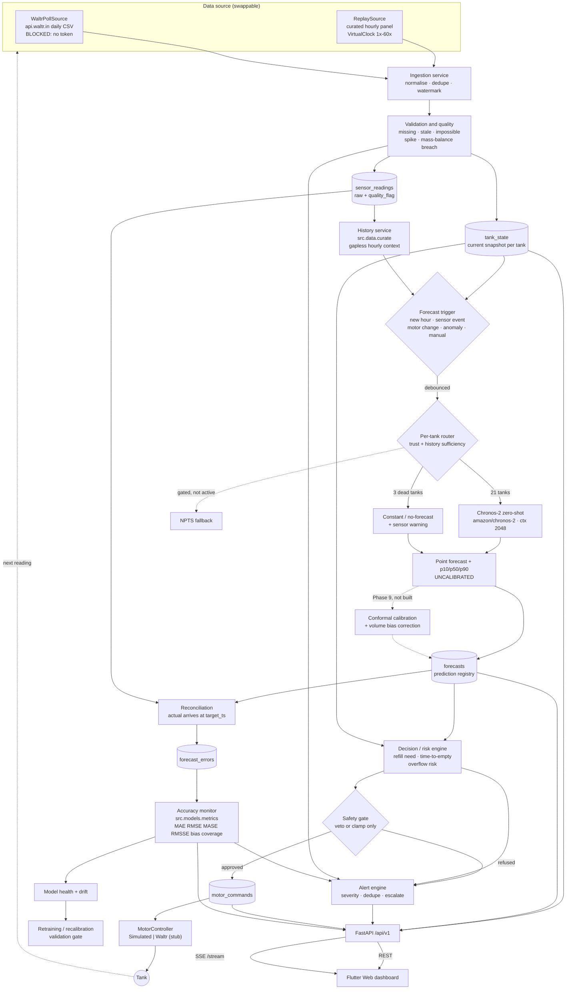
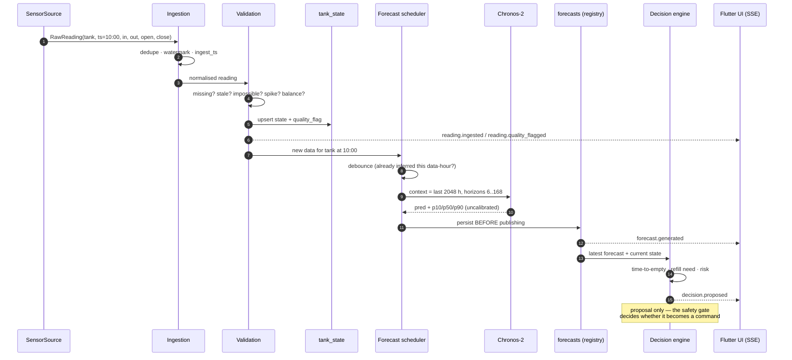
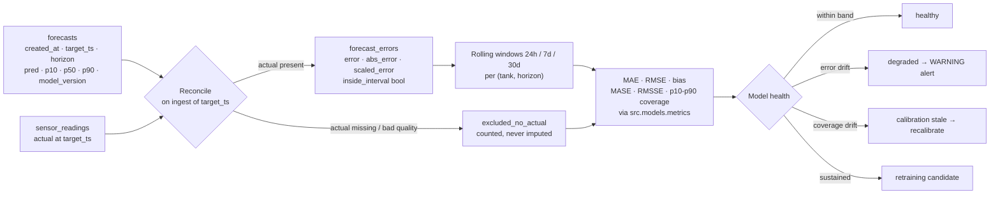
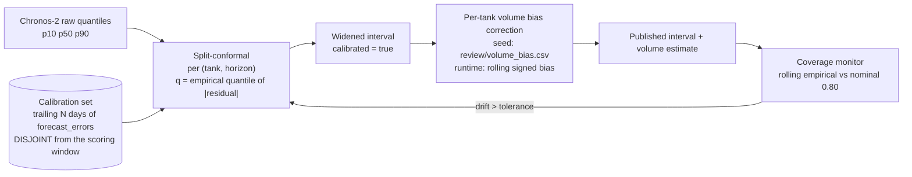
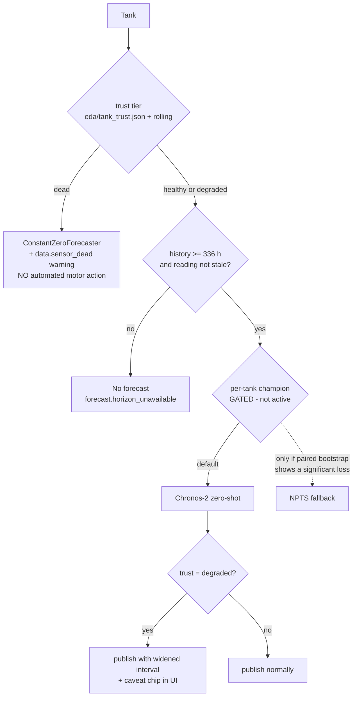
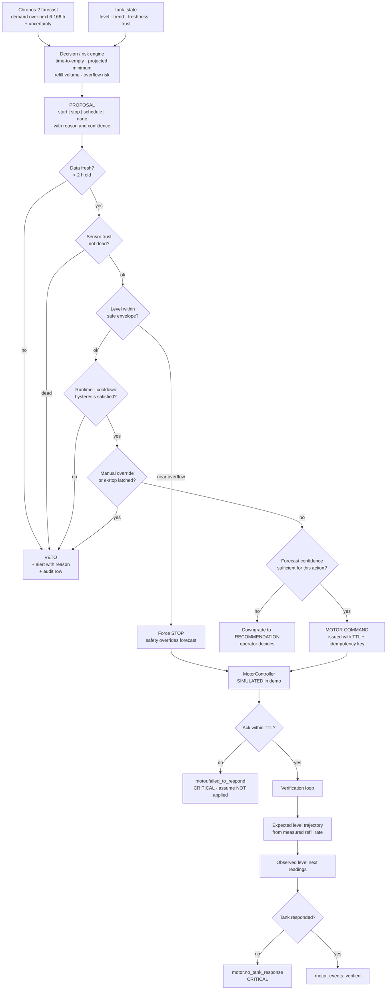
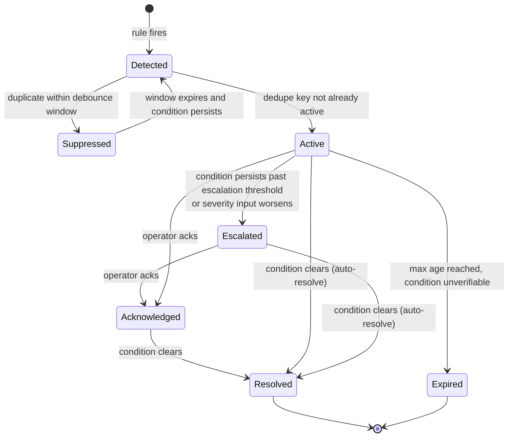
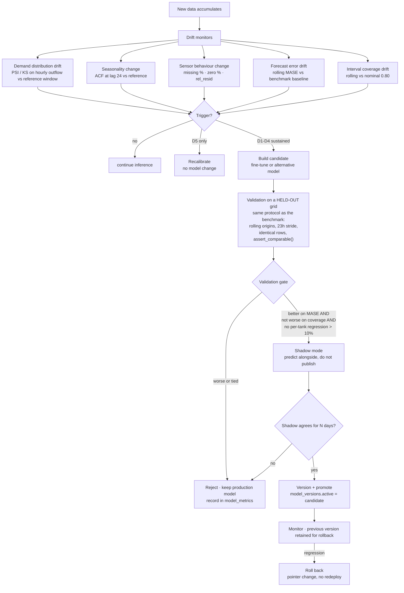
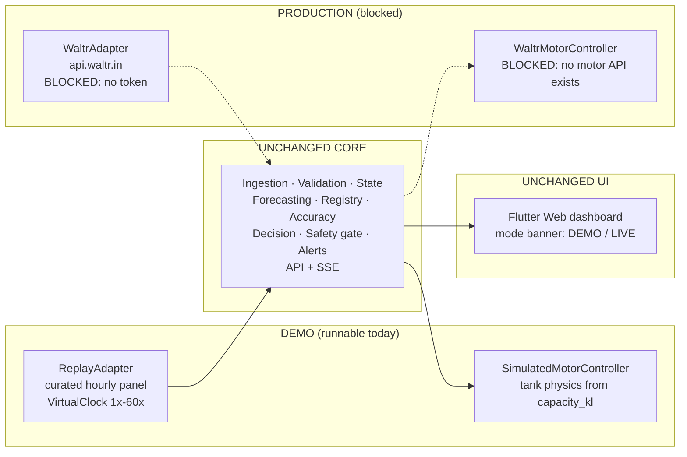
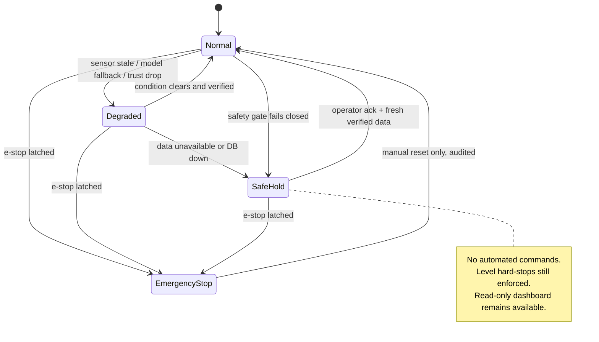

# Real-time water management architecture

**PW26_PK_06 · Intelligent Water Management System · PES University RR**
24 tanks · hourly · design document · status: **proposed, not implemented**

This document specifies the system that turns the completed Chronos-2 forecasting study into a
running real-time forecasting, monitoring, alerting and motor decision-support pipeline. It is a
blueprint. Companion documents: [`implementation_plan.md`](implementation_plan.md),
[`api_design.md`](api_design.md), [`data_model.md`](data_model.md),
[`demo_plan.md`](demo_plan.md), [`safety_and_controls.md`](safety_and_controls.md).

---

## 0. Status — what is true today

Stated plainly, because every design decision below depends on it.

| Claim | Status |
|---|---|
| Chronos-2 benchmark, 24 tanks × 24 origins × 6 horizons, 9 models | **Complete.** `results/chronos2/`, `docs/review_summary.md`. Not modified by this work. |
| Offline forecasting pipeline (`src/data`, `src/models`) | **Implemented**, and reused verbatim by this design |
| Precomputed forecast bundle + Chrome dock | **Implemented.** `extension/waltr-dock/forecast_bundle.json` holds real Chronos-2 forward forecasts from 2026-04-22 23:00 |
| WALTR HTTP client (daily CSV per tank) | **Implemented but unusable today** — `extension/api/app/waltr_sync.py` requires a JWT and **no working token is currently available** |
| Live WALTR connection | **Does not exist** |
| Motor / pump / valve control API | **Does not exist**, and none has been specified by the WALTR team |
| Motor telemetry in the dataset | **Does not exist.** The record carries only `Inflow in KL`, `Outflow in KL`, `Opening Value in KL`, `Closing Value in KL` per tank-hour |
| Real-time ingestion, state store, database, alerts, decision engine, replay | **None of it exists.** No SQLAlchemy, Alembic or psycopg import appears anywhere in the repository |
| Conformal interval calibration | **Not implemented.** Measured p10–p90 coverage is **0.714–0.743** against a nominal 0.80 |
| Per-tank volume bias correction | **Not implemented.** Measured 24 h volume bias is **−12.15 %** pooled, −9.5 % on healthy tanks |

Consequently: motor behaviour in the demo is **simulated**, and historical motor activity is
**inferred from inflow**. Both are labelled as such in the data model, the API and the UI. Nothing
in this system is permitted to present a replayed value as a live measurement.

---

## 1. Design principles

1. **The data source is an adapter, not an assumption.** Replay and WALTR implement one protocol.
   Nothing downstream knows which is attached.
2. **Forecasting never actuates.** The model produces numbers. A separate decision engine turns
   numbers into proposals. A separate safety gate turns proposals into commands, and can only
   veto or clamp — never amplify.
3. **Absence is a value.** A missing reading is stored as `NULL` with a quality flag. It is never
   coerced to zero, never interpolated silently, and never rendered as a measurement.
4. **Every published number carries provenance.** `actual` / `predicted` / `inferred` /
   `simulated` / `stale` / `unavailable` are distinct states in the schema and in the UI.
5. **Thresholds live in the database, not in the code.** Per-tank safety limits are configuration
   with defaults derived from measurement, and are auditable when changed.
6. **Fail safe, not fail quiet.** Every degraded path has a defined safe default and raises an
   event. Silence is never a valid response to a failure.

---

## 2. The adapter seam

Four protocols. Everything downstream depends only on these.

```python
class Clock(Protocol):
    def now(self) -> datetime: ...          # RealClock | VirtualClock(speed)

class SensorSource(Protocol):
    async def stream(self) -> AsyncIterator[RawReading]: ...
    # ReplaySource(curated panel) | WaltrPollSource | (future) WaltrPushSource

class MotorController(Protocol):
    async def apply(self, cmd: MotorCommand) -> CommandAck: ...
    async def state(self, tank_id: str) -> MotorState: ...
    # SimulatedMotorController | WaltrMotorController (stub: raises NotImplementedError)

class Forecaster(Protocol):
    def predict(self, ctx: ForecastContext) -> ForecastResult: ...
    # Chronos2Forecaster | SeasonalNaiveForecaster | ConstantZeroForecaster
```

Switching the whole system from demo to production is a settings change:

```
DEMO :  SOURCE=replay  MOTOR=simulated  CLOCK=virtual  MODE=replay
PROD :  SOURCE=waltr   MOTOR=waltr      CLOCK=real     MODE=live
```

Validation, state store, forecast service, prediction registry, decision engine, alerting, the
API and the Flutter UI are untouched by that switch. This is the single most important structural
property of the design, and §11 shows it as a diagram.

---

## 3. End-to-end pipeline



---

## 4. Component catalogue

Each component, why it exists, and what happens when it fails.

| Component | Why it exists | On failure |
|---|---|---|
| **Ingestion service** | Single entry point for readings regardless of source. Normalises to one `RawReading` shape, assigns `ingest_ts`, maintains a per-tank watermark, and rejects duplicates. Without it, every downstream component would have to know the source format. | Raises `system.ingest_failed`; state store keeps last known values and freshness ages; decision engine degrades to level-only rules (§10) |
| **Validation & quality** | Sensor data is demonstrably dirty — the panel has tanks with 19.9 % and 20.7 % missing hours, and 26.5 % of all observed hourly readings are exactly zero. Nothing may reach the state store unclassified. | Reading is stored with `quality_flag='unvalidated'` and treated as untrusted; no automated motor action permitted on it |
| **State store (`tank_state`)** | One authoritative row per tank holding everything the UI and the decision engine read. Avoids recomputing derived state on every request. | Rebuildable from `sensor_readings` + `forecasts` at startup; the table is a cache with a durable source |
| **History service** | Supplies the forecaster its context window. Wraps `src.data.curate.load_curated_hourly()` and `reindex_gapless_hourly()` so the runtime context has the same gapless hourly index the benchmark used. **Collapsing a gap would shift later timestamps and corrupt the 24-hour seasonality the model relies on.** | Forecast is skipped and `forecast.horizon_unavailable` raised; last forecast stays, marked stale |
| **Forecast scheduler** | Decides *when* to infer. Prevents both starvation (no forecast for hours) and thrash (repeated inference on identical information). | Falls back to a fixed hourly timer |
| **Per-tank router** | Chronos-2 does not win every tank; on the 3 dead tanks a constant-zero forecast beats it outright. Routing is an accuracy improvement *and* a compute saving. | Defaults to Chronos-2 for any tank whose routing record is unreadable |
| **Chronos-2 forecaster** | The measured production candidate. Wraps `src.models.chronos2_forecasting.forecast_one()` with a warm pipeline held in process. | Falls back to `SeasonalNaiveForecaster` (`src.models.backtest.seasonal_naive_forecast`), flags the forecast `degraded_model`, raises `model.unavailable` |
| **Prediction registry (`forecasts`)** | Stores every prediction the instant it is made, with model version and bounds, so accuracy can be judged retrospectively and honestly. Without it there is no way to prove the system worked. | Forecast is not published; a forecast that cannot be recorded must not be acted on |
| **Reconciliation** | Joins each stored prediction to the actual when it arrives at `target_ts`, including late arrivals. | Backfilled on next successful ingest; errors are computed from the durable tables, never from memory |
| **Accuracy monitor** | Rolling MAE / RMSE / bias / MASE / RMSSE / interval coverage per (tank, horizon), reusing `src.models.metrics` so runtime numbers are computed identically to the benchmark numbers. | Model health goes `unknown`; decision engine treats forecasts as low-confidence |
| **Decision / risk engine** | Converts level, demand forecast and uncertainty into a *proposal* (refill now / refill in N h / no action). Kept separate so the forecasting model can be replaced without touching operational logic. | No proposals issued; level-threshold rules in the safety gate still protect the tank |
| **Safety gate** | The only component that can authorise a motor command. Applies the constraint set in [`safety_and_controls.md`](safety_and_controls.md). Can veto or clamp, never amplify. | **Fails closed** — no command is issued, `motor.automatic_control_disabled` raised |
| **Motor controller** | Adapter to the physical system. Simulated today. | Command marked `unacked` after TTL; `motor.failed_to_respond` raised at CRITICAL |
| **Alert engine** | Turns events into deduplicated, severity-ranked, resolvable notifications. Without dedup a single stuck sensor emits an alert every hour forever. | Events still land in `system_events`; SSE clients see a gap and the UI shows the stream as disconnected |
| **API + SSE** | The only interface the UI has. | UI shows last-known state with a stale banner; it never invents values |

---

## 5. Real-time data pipeline

### 5.1 Ingestion

* **Frequency.** The underlying record is **hourly**. The replay source emits one reading per
  tank-hour of virtual time; the WALTR poll source polls every 5 minutes for the current day's
  CSV and emits only rows it has not seen. Neither invents sub-hourly resolution.
* **Timestamps.** Sensor timestamps are naive local (`Asia/Kolkata`) in the source
  (`"2026-04-22 00"` → hour precision). They are stored as UTC with the original local timestamp
  retained. `ingest_ts` is separate from `reading_ts`; the two are never conflated.
* **Watermark.** Per tank, the highest `reading_ts` accepted. Used for stale detection and for
  out-of-order handling.

### 5.2 Quality rules

Every rule has a concrete definition and a source. `quality_flag` is an enum on
`sensor_readings`; multiple flags are stored as a set.

| Flag | Rule | Source / evidence |
|---|---|---|
| `ok` | Passes everything below | — |
| `missing` | Hour exists on the gapless index with no reading | `reindex_gapless_hourly()` in `src/data/curate.py` — missing hours become NaN, never dropped |
| `stale` | `now - watermark > 2 × 1 h` (i.e. no new reading for over 2 hours) | Ingestion is hourly; two consecutive misses is the first unambiguous signal |
| `duplicate` | `(tank, reading_ts)` already present | Keep the **last** write, increment a counter, raise INFO. Mirrors `drop_duplicates(keep="last")` in `curate.py` |
| `out_of_order` | `reading_ts < watermark` | Accepted and stored (late arrival), then **re-triggers reconciliation** for any forecast whose `target_ts` it fills. Never silently discarded |
| `impossible` | `Outflow < 0` or `Inflow < 0` or `level < 0` or `level > geometric_capacity_kl` | Geometric capacity from `capacity_kl()` in `src/models/build_dock_bundle.py`, parsed from `Tank Dimensions` |
| `balance_breach` | `abs(Opening + Inflow − Outflow − Closing) > max(0.1 KL, 0.25 × mean flow)` | The exact relative threshold implemented in `eda/eda_hourly.py` §A. An absolute threshold ranks tanks by size, not by sensor quality |
| `spike` | `abs(Δ) > rolling_mean(Δ) + 3σ` **and** value above the practical cap (`p99 × 1.3`) | The rule already implemented and working in `extension/api/app/services.py::anomaly_clean_preview` |
| `sensor_dead` | Rolling 24 h: mean `< 0.01 KL/h` **or** `> 90 %` zero hours | The `dead` tier rule from `eda/eda_hourly.py`; seeded from `eda/tank_trust.json` (3 tanks) |

**A missing reading is never stored or displayed as zero.** This is the rule that most easily
gets violated by accident, so it is asserted in tests (Phase 1) and enforced by a `NOT NULL`-free
column plus a check constraint that `value IS NULL` implies `quality_flag <> 'ok'`.

### 5.3 Sensor trust

Seeded from `eda/tank_trust.json` — **15 healthy, 6 degraded, 3 dead**. At runtime a rolling
trust score is maintained per tank on the same three inputs the EDA used (missing %, zero %,
relative mass-balance residual) over a trailing 7-day window. Tier changes raise
`data.sensor_trust_degraded` / `data.sensor_recovered` and are written to `system_events` with
both the old and new tier.

Trust gates automation, not display: a `degraded` tank is still forecast and still shown, but
its automated motor authority is reduced; a `dead` tank gets no forecast and no automated action
at all (§9, §10).

### 5.4 Tank state

One row per tank, updated on every accepted reading and every forecast. Fields are enumerated in
[`data_model.md`](data_model.md); the operationally important ones:

`level_kl`, `level_pct`, `inflow_kl_h`, `outflow_kl_h`, `reading_ts`, `ingest_ts`,
`seconds_since_reading`, `quality_flag`, `trust_tier`, `motor_state`, `motor_command_state`,
`latest_forecast_id`, `p10`/`p90` for the next step, `last_prediction_error`,
`rolling_mae_24h`, `rolling_mase_24h`, `interval_coverage_7d`, `mode` (`replay` | `live`).

`level_pct` is computed against **observed operating range**, not geometric volume, because the
two differ materially — `BE_BLOCK_OHT` has a geometric capacity of 66.39 KL but an observed
maximum level of 60.21 KL. The dock already uses the observed range for exactly this reason, and
the UI shows both.

---

## 6. Forecasting engine

* **Model.** Chronos-2 zero-shot (`amazon/chronos-2`), context 2048, quantiles
  `[0.1, 0.25, 0.5, 0.75, 0.9]`, outputs clipped at 0 because outflow is physically non-negative.
  Loaded once at startup and held warm.
* **Covariates: none.** The benchmark measured the covariate gain at **≤ 0.0025 MASE for 4–10×
  the compute**. Shipping the covariate pipeline would add a failure mode for no measured benefit.
* **Horizons.** 6 h, 12 h, 24 h, 48 h, 72 h, 168 h — the same six the benchmark scored, so runtime
  accuracy is directly comparable to the published table.
* **Input history window.** 2048 hours (~85 days) of gapless hourly context per tank, matching the
  benchmark exactly. A tank with less than 2048 h of record uses everything it has; below
  **336 h (14 days)** the router refuses to forecast and raises `forecast.horizon_unavailable`.
* **Storage.** Every forecast row is persisted before publication: `(tank, created_at, target_ts,
  horizon, model_version, pred, p10, p50, p90, calibrated: bool, run_id)`.
* **Model versioning.** `model_versions` records model id, revision, code commit, device,
  context length and activation window. Every forecast references one. Rollback is a pointer change.
* **Latency monitoring.** Per-run wall clock recorded on `forecast_runs`, exported to Prometheus.

### 6.1 Cadence — when to infer

**Event-driven on new data, not on a wall clock.** The record is hourly; a new forecast is only
meaningful once a new hour has landed. Regenerate when:

| Trigger | Rationale |
|---|---|
| New hourly reading accepted | The only routine trigger. One inference per tank-hour |
| Sensor state transition (`ok`↔`stale`/`missing`/`dead`) | The context changed materially |
| Motor state change | Inflow is a past covariate of the tank's trajectory; a refill invalidates the level path |
| Anomaly detected (`spike`, `balance_breach`) | The context may be corrupt; re-forecast and widen caution |
| Model version or calibration change | Old forecasts are no longer comparable |
| Manual request from an operator | Explicit |

**Do not regenerate** when nothing new has arrived. Debounce: at most one inference per tank per
data-hour per trigger class, coalesced across triggers firing within the same hour.

**Cost basis for "hourly is affordable":** the benchmark measured **89 s for 144 batched
(origin × horizon) calls covering all 24 tanks** — about **0.6 s per call for the whole fleet** on
an Apple MPS laptop GPU. One hourly tick is 6 calls (one per horizon) ≈ **4 s of GPU time per
hour**, i.e. ~0.1 % duty cycle. Hourly inference for the whole campus is not a cost problem.
Per-tank inference would be, which is why calls stay batched across tanks.



---

## 7. Prediction vs actual — the feedback loop

Every forecast is a falsifiable claim, recorded before the answer is known.

```
Forecast created 10:00 · target 11:00 · horizon 6h · model chronos-2@rev · pred 0.72 KL/h
Actual arrives    11:00 · 0.69 KL/h
Error                    −0.03 KL/h  ·  |e| 0.03  ·  scaled by that tank's pre-origin MASE denominator
Stored permanently in forecast_errors. Never recomputed from memory.
```



**Scaling.** MASE/RMSSE denominators use `src.models.metrics.seasonal_scales()` with `m = 24`,
computed on history **strictly before** the forecast origin — the same rule as the benchmark.
Tanks with a zero scale are **excluded and counted**, never epsilon-patched. `n_tanks_scaled` is
surfaced so an exclusion is always visible.

**Late arrivals.** An out-of-order reading that fills a `target_ts` re-triggers reconciliation for
every affected forecast and recomputes the affected rolling windows. Rolling metrics are therefore
derived quantities, always recomputable from `forecast_errors`.

**What the UI must not show.** No "accuracy %". MASE is a ratio to the seasonal-naive baseline —
0.65 does not mean 65 % accurate. The UI shows MAE in KL/h, MASE as a labelled ratio with the
1.0 reference marked, and 24 h volume error as a percentage **only** for tanks whose 24 h demand
exceeds 1 KL, because below that a percentage is meaningless (6 tanks fail this test).

---

## 8. Uncertainty and calibration

**Current state, measured:** Chronos-2's p10–p90 band covers **0.714–0.743** against a nominal
0.80, and is the narrowest band of any model in the study (0.56–0.63 KL/h vs NPTS 0.68). It is
**overconfident**. Combined with the −12.15 % volume under-forecast, the two errors point the
same way: *too low and too confident*.

**Until calibration exists, intervals are published with `calibrated = false` and the UI labels
them "uncalibrated · measured coverage 72 %, nominal 80 %".** That label is not optional.

Planned layer (Phase 9, not built):



* **Separation.** The calibration window and the window used to report coverage must not overlap,
  or the reported coverage is circular. A rolling split: calibrate on days `[t−28, t−7)`, report
  coverage on `[t−7, t]`.
* **Seed.** `results/chronos2/review/volume_bias.csv` (signed bias per model × horizon) and
  `per_tank_daily_volume_accuracy.csv` (per-tank 24 h bias) give the offline starting table. The
  runtime version refits from `forecast_errors`.
* **Update cadence.** Nightly recompute; immediate recompute if rolling coverage leaves
  `0.80 ± 0.05` for 3 consecutive days.
* **Not claimed.** No part of this exists yet. Any interval shown before Phase 9 lands is raw
  Chronos-2 output.

---

## 9. Per-tank router

The benchmark shows Chronos-2 wins **16–19 of 24 tanks** depending on horizon — not all of them.



**What ships:** the `dead` branch only — `BE_BLOCK_RO`, `INFORMATION_CENTRE`, `NEW_BLOCK_RO`.
This is measured: on `INFORMATION_CENTRE` a constant-zero forecast beats Chronos-2 outright
(MASE 2.06 at 1 d), and all three tanks average under 0.01 KL/h.

**What does not ship:** automatic NPTS routing. At the 1-day horizon the tanks Chronos-2 loses
are `NBX` −2.40 %, `INFORMATION_CENTRE` −1.89 %, `CRICKET_GROUND_OHT` −1.46 %, `G_BLOCK` −1.08 %,
`GJBC_BLOCK_1_A4_RO` −0.80 %, `I&H_BLOCK` −0.78 % (MAE basis, `per_tank_comparison.csv`). Those
margins are within noise, and `docs/review_summary.md` §13.2 states explicitly that **no
significance test was run**.

**Gating test before the NPTS branch may be activated:** a paired bootstrap over the 24 origins
per (tank, horizon), resampling origins with replacement, requiring the 95 % CI on the
Chronos-2 − NPTS MAE difference to exclude zero in NPTS's favour, for at least 4 of the 6
horizons. Until that test is run and recorded in `model_metrics`, the branch stays dark.

`GJBC_LAW_BLOCK_3__A1` is deliberately **not** routed away: it is a healthy sensor with MASE
1.11–1.69, which is a modelling weakness, not a data problem. Routing it to NPTS (MASE 1.60 at
1 d) would not fix it. It is flagged in the UI as low-confidence and left as a research item.

---

## 10. Decision and motor flow

Full specification in [`safety_and_controls.md`](safety_and_controls.md). The structural claim:



Three properties this diagram enforces:

1. **The forecast is an input to the gate, never a bypass of it.** Every arrow from `FC` passes
   through `G1..G6`.
2. **Safety can act without a forecast; a forecast cannot act without safety.** `G3` can force a
   stop with no model involvement at all.
3. **Low confidence downgrades to advice.** `G6` turns an automated action into a recommendation
   rather than acting aggressively on an uncertain number — which is exactly the failure mode the
   measured −12 % volume bias and 72 % interval coverage would otherwise cause.

---

## 11. Alerting

Severity: `INFO` · `WARNING` · `CRITICAL` · `RESOLVED`. Full taxonomy and priority rules in
[`safety_and_controls.md`](safety_and_controls.md) §5–6; the lifecycle:



**Deduplication** is by `(tank_id, event_type, mode)`. While an alert with that key is `Active` or
`Escalated`, a repeat updates `last_seen_at` and `occurrence_count` instead of creating a row.
**Debounce** windows are per event type (e.g. `data.sensor_delayed` 30 min,
`tank.approaching_minimum` 1 h, `motor.cycling_too_frequently` 6 h). This is what stops a single
stuck sensor from producing hundreds of identical notifications.

**Auto-resolve** requires the condition to be *observed* clear, not merely absent: a
`data.sensor_stale` alert resolves on a fresh reading, not on a timeout.

---

## 12. Retraining and drift

Chronos-2 is used **zero-shot** — there are no weights being fitted, so "retraining" here means
three separable things, and the design keeps them separate because they have different costs and
different risks:

| Activity | Cost | Cadence |
|---|---|---|
| **Recalibration** (conformal quantiles, volume bias) | seconds | nightly, or on coverage drift |
| **Re-evaluation** (re-score the champion vs challengers on a fresh rolling-origin grid) | ~26 min for baselines + ~1.5 min Chronos-2, per `run_manifest.json` | weekly |
| **Fine-tuning** Chronos-2 on campus history | hours, GPU | only if re-evaluation shows sustained degradation; explicitly a research step |



**A better training score is never sufficient to promote.** The gate requires a win on a held-out
rolling-origin grid scored by the same `assert_comparable()` row-parity check the benchmark used,
plus no coverage regression, plus no single tank regressing more than 10 %. The previous version
stays loadable at all times; rollback is a pointer change in `model_versions`, not a redeploy.

**Thresholds are configuration**, stored in `tank_config` / a `monitoring_config` table, with
proposed starting values (PSI > 0.25, rolling MASE > benchmark + 15 % for 7 days, coverage outside
0.80 ± 0.05 for 3 days) that are explicitly first guesses to be tuned against observed
false-alarm rates — not tuned values presented as if measured.

---

## 13. Demo → production migration



What changes at cutover: two settings values and one credential. What does not change: the
pipeline, the schema, the API contract, the UI. The `mode` column on every fact table means demo
rows and live rows can coexist in one database without ever being aggregated together.

---

## 14. Degradation matrix

| Failure | System behaviour | Motor authority |
|---|---|---|
| Sensor stale (> 2 h) | Level shown greyed with age; forecasts continue from last good context, flagged | **No automated start.** A running motor stops at the safe level |
| Sensor missing (single hour) | Hour stored NULL + `missing`; context keeps the gap open | Unchanged if the rest of the window is fresh |
| Sensor dead | No forecast; tank shown as no-signal | **None.** Alert only |
| Data source down entirely | `system.data_pipeline_down` CRITICAL; all tanks age into stale | **All automation disabled**, level-threshold hard stops remain |
| Chronos-2 unavailable | Fall back to seasonal-naive, flag `degraded_model`, WARNING | Decision engine treats forecasts as low confidence → recommendations only |
| Database unavailable | API returns 503; **no forecast is published and no command is issued** — an unrecordable action is not permitted | **Fails closed** |
| SSE stream drops | UI reconnects (`EventSource` auto-retry) and re-fetches state via REST; shows a disconnected banner | Unaffected — the UI is not in the control path |
| Motor controller unreachable | Command marked `unacked` at TTL; CRITICAL alert; assumed **not** applied | No retry loop without operator ack |
| Conflicting commands | Newest command with a valid idempotency key wins; the loser is recorded as `superseded`; if they conflict on safety, **stop wins over start, always** | — |



---

## 15. Technology choices

Chosen to be the simplest stack that can evolve demo → WALTR → production without a rewrite.

| Layer | Choice | Why this and not the alternative |
|---|---|---|
| Backend | **FastAPI** (Python 3.13, existing `venv/`) | Already the pattern in `extension/api`; and the forecaster is a Python object that must stay in-process to stay warm. A separate Go/Node tier would require an RPC hop to the model for no gain |
| Persistence | **SQLAlchemy 2.x + Alembic**, SQLite for demo, **Postgres 16** for prod | 24 tanks × 1 row/hour ≈ 210 k rows/year. SQLite is ample for the demo and needs no service; the identical ORM runs on the Postgres already declared (and currently unused) in `extension/deploy/docker-compose.yml`. TimescaleDB would be infrastructure for a volume problem that does not exist |
| Real-time | **SSE** (`text/event-stream`) | One-way server→client. `EventSource` reconnects automatically, needs no sticky sessions, and passes through the existing nginx config unchanged. WebSockets add a bidirectional channel the UI does not need — commands are ordinary POSTs. Polling is rejected because 60× replay would need sub-second polls |
| Scheduling | **APScheduler in-process** | The demo must run on a laptop. Celery + Redis is already in compose and stays available for long retraining jobs in production, but introducing a broker as a hard dependency for an hourly tick is unjustified |
| Inference | **In-process `Chronos2Pipeline`**, warm, behind the `Forecaster` protocol | Cold-loading a 119.5 M-parameter model per request would dominate the 0.6 s/call budget |
| Frontend | **Flutter Web** + `fl_chart` + Riverpod | The real WALTR app is itself a Flutter Web build painting to canvas (documented in `extension/waltr-dock/README.md`), so this is the only UI technology that can eventually merge with it. Theme ported from `capsem6/extension/tokens.css` |
| Auth | **JWT** (claims per `extension/docs/integration-waltr.md`) + **HMAC** internal signing | Both patterns already implemented in `extension/api/app/auth.py`; reuse rather than reinvent |
| Observability | **structlog** JSON + `prometheus-fastapi-instrumentator` + optional Sentry | All three are already dependencies of `extension/api` |

**Deliberately not introduced:** Kafka, TimescaleDB, a service mesh, a separate model-serving
tier, an MLflow registry. Each solves a problem this system does not have at 24 tanks and one
row per hour.

---

## 16. Observability

Traceable by design: every reading carries `ingest_ts`, every forecast a `run_id`, every command
an idempotency key, and every one of them a `correlation_id` that follows the causal chain
reading → forecast → decision → command → verification.

| Signal | Metric | Alert condition |
|---|---|---|
| Ingestion | `ingest_lag_seconds` (reading_ts → ingest_ts), `readings_rejected_total{reason}` | lag > 2 h; rejection rate > 5 % |
| Forecast | `forecast_latency_seconds{horizon}`, `forecast_failures_total`, `forecast_skipped_total{reason}` | p95 latency > 30 s; any failure |
| Accuracy | `rolling_mase{tank,horizon}`, `interval_coverage{tank,horizon}` | MASE > benchmark + 15 % for 7 d; coverage outside 0.80 ± 0.05 |
| API | request latency histogram, 5xx rate | p95 > 1 s; 5xx > 1 % |
| Alerts | `alert_delivery_failures_total` | any |
| Motor | `motor_commands_total{result}`, `motor_unacked_total` | any unacked |
| Database | connection failures, write latency | any failure |
| Model | active `model_version`, time since last successful inference | > 3 h without a successful inference |

---

## 17. Implementation status

| Already implemented | For the demo | Requires a WALTR token | Requires a motor API |
|---|---|---|---|
| Curation, calendar features, backtest harness, metrics | Ingestion, validation, state store, database | `WaltrPollSource` | `WaltrMotorController` |
| Chronos-2 inference wrapper | Replay engine + virtual clock | Live-mode scheduling and backfill | Real command dispatch and ack |
| Trust tiers (`eda/tank_trust.json`) | Prediction registry + reconciliation | Token rotation / secret handling | Physical interlock verification |
| Benchmark, review package, plots | Accuracy monitor, alert engine | Dual-run validation vs replay | Staged rollout (recommend → shadow → act) |
| WALTR HTTP client (unusable without a token) | Decision engine + safety gate | | Field commissioning and sign-off |
| HMAC auth, Docker/compose, CI skeleton | Simulated motor + Flutter dashboard | | |
| | Conformal calibration + bias correction | | |

Phase-by-phase delivery, tests and acceptance criteria: [`implementation_plan.md`](implementation_plan.md).
