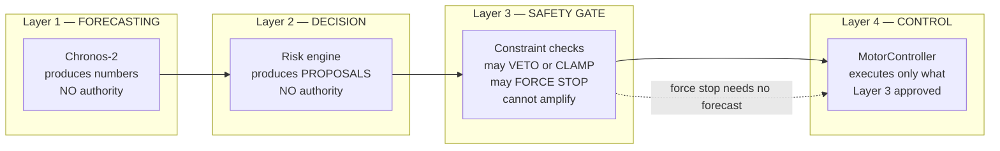
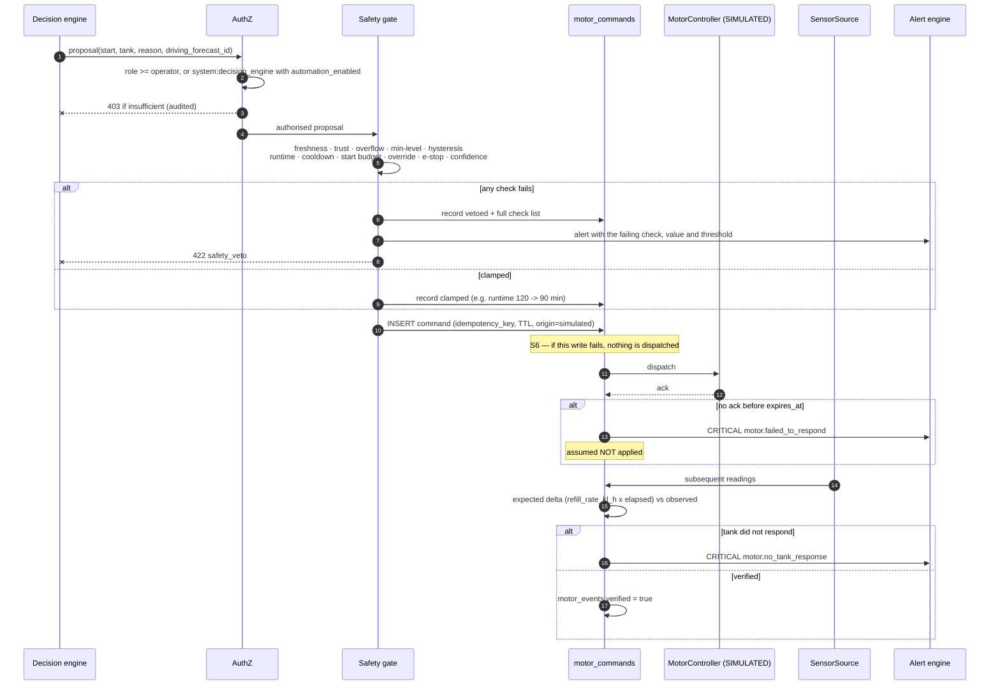

# Safety and controls

**Status: proposed. No motor control exists.**

Two facts govern this entire document and are repeated deliberately:

1. **There is no motor-control API.** None has been specified, offered or documented by the WALTR
   team. `WaltrMotorController` is a stub that raises.
2. **There is no motor telemetry in the dataset.** The record carries `Inflow in KL`,
   `Outflow in KL`, `Opening Value in KL`, `Closing Value in KL` and nothing else. Historical
   motor activity is **inferred** from inflow; demo motor activity is **simulated**.

Every command, event and UI element originating from this subsystem is therefore labelled
`SIMULATED` or `INFERRED` until a real interface exists and has been commissioned.

---

## 1. Separation of concerns

The invariants, stated as properties that must hold and be testable:

| # | Invariant |
|---|---|
| S1 | No command reaches Layer 4 without passing Layer 3. There is no bypass path, no debug flag, no admin shortcut |
| S2 | Layer 3 can act with no forecast at all (level hard-stops). Layer 1 can never act without Layer 3 |
| S3 | A forecast may **advance** a refill inside the safety envelope. It may never suppress a safety-triggered refill, extend a runtime limit, shorten a cooldown, or clear an e-stop |
| S4 | When any input required by a check is unavailable, the check **fails** — it does not skip |
| S5 | `stop` beats `start`. Always. Regardless of authority, ordering or recency |
| S6 | A command that cannot be written to `motor_commands` is not issued |

---

## 2. Constraint set

All values live in `tank_config` (see [`data_model.md`](data_model.md) §2), are editable by
`admin`, and every change is written to `audit_log` with before/after.

### 2.1 Level constraints

Expressed as a percentage of **observed operating maximum**, not geometric capacity — the two
differ materially (`BE_BLOCK_OHT`: 60.21 KL observed vs 66.39 KL geometric) and a level percentage
computed against geometry would consistently under-read the true fullness.

| Constraint | Default | Behaviour |
|---|---|---|
| `level_overflow_pct` | 97 % | **Forced stop.** Overrides every other consideration including an operator start |
| `level_high_warn_pct` | 92 % | WARNING alert; no new start authorised |
| `level_target_pct` | 85 % | Normal stop point |
| `level_min_operating_pct` | 20 % | Normal start point |
| `level_critical_low_pct` | 10 % | CRITICAL alert; refill requested **regardless of forecast** |

Hysteresis is the 20 % ↔ 85 % band: start below 20 %, stop at 85 %, and never start again until
the level has fallen back below 20 %. Without it a tank hovering at the threshold would chatter.

These defaults are **starting values, not measured optima**. The measured drawdown record shows
they are in the right place but will need tuning: in 2026 `BE_BLOCK_OHT` spent 193 hours below
20 % and 96 hours below 10 %, `G_BLOCK` 236 hours below 20 %, `MM_BLOCK` 60 hours below 20 % and
19 below 10 %. A 20 % start threshold would therefore have triggered frequently on real history —
which is the point of tuning against replay before any real actuation (Phase 11).

### 2.2 Motor constraints — per tank, derived from measurement

Derivation, applied uniformly so it can be audited:

* `motor_max_runtime_min` = **p95 of observed refill run length × 1.5**, floor 60 min
* `motor_cooldown_min` = **5th percentile of observed gap between refill starts**, floor 30 min
* `motor_max_starts_per_day` = **ceil(observed refill starts/day × 2)**, floor 2
* `refill_rate_kl_h` = **median inflow during observed refill runs** — used for trajectory
  verification, not for control

A refill "run" is a maximal contiguous span of hours with `Inflow in KL > 0.05`. Computed over the
full curated panel (2025-01-01 → 2026-04-22, 24 tanks).

| Tank | Trust | Obs max (KL) | Geom (KL) | Runs/day | Run p95 (h) | Gap p05 (h) | Refill rate (KL/h) | `max_runtime_min` | `cooldown_min` | `max_starts_day` |
|---|---|---|---|---|---|---|---|---|---|---|
| `BE_BLOCK_OHT` | healthy | 60.21 | 66.39 | 1.82 | 10 | 3.0 | 4.81 | 900 | 180 | 4 |
| `BE_BLOCK_RO` | dead | 0.90 | 1.14 | 0.47 | 3 | 2.0 | 0.13 | 270 | 120 | 2 |
| `CRICKET_GROUND_OHT` | degraded | 6.79 | 7.16 | 0.90 | 2 | 2.0 | 0.32 | 180 | 120 | 2 |
| `F_BLOCK` | healthy | 40.68 | 48.53 | 1.77 | 5 | 2.0 | 3.06 | 450 | 120 | 4 |
| `GJBC_BLOCK_1_A1_BOYS` | degraded | 9.49 | 11.13 | 1.93 | 10 | 3.0 | 0.48 | 900 | 180 | 4 |
| `GJBC_BLOCK_1_A2_GIRLS` | healthy | 9.97 | 11.54 | 2.04 | 10 | 3.0 | 0.29 | 900 | 180 | 5 |
| `GJBC_BLOCK_1_A3` | healthy | 11.12 | 13.07 | 2.04 | 10 | 3.0 | 0.59 | 900 | 180 | 5 |
| `GJBC_BLOCK_1_A4_RO` | degraded | 2.79 | 3.31 | 1.34 | 7 | 2.8 | 0.30 | 630 | 168 | 3 |
| `GJBC_BLOCK_2_A1` | healthy | 10.02 | 11.63 | 2.08 | 3 | 2.0 | 2.33 | 270 | 120 | 5 |
| `GJBC_LAW_BLOCK_3_A4_BOYS` | healthy | 21.95 | 25.41 | 3.01 | 10 | 2.0 | 2.44 | 900 | 120 | 7 |
| `GJBC_LAW_BLOCK_3__A1` | healthy | 21.86 | 25.19 | 1.90 | 10 | 3.0 | 0.57 | 900 | 180 | 4 |
| `GJBC_LAW_BLOCK_3__A2` | healthy | 22.42 | 25.75 | 2.02 | 9 | 3.0 | 0.61 | 810 | 180 | 5 |
| `GJBC_LAW_BLOCK_3__A3_GIRLS` | healthy | 23.28 | 26.82 | 2.07 | 9 | 3.0 | 1.20 | 810 | 180 | 5 |
| `G_BLOCK` | healthy | 22.74 | 26.55 | 2.34 | 6 | 2.7 | 2.88 | 540 | 162 | 5 |
| `I&H_BLOCK` | degraded | 20.50 | 24.42 | 3.03 | 4 | 2.0 | 0.46 | 360 | 120 | 7 |
| `INFORMATION_CENTRE` | dead | 0.80 | 1.04 | 0.28 | 7 | 4.0 | 0.09 | 630 | 240 | 2 |
| `IT_BLOCK` | degraded | 3.54 | 4.48 | 3.80 | 4 | 2.0 | 0.09 | 360 | 120 | 8 |
| `ME_WORKSHOP_BLOCK` | degraded | 4.32 | 5.05 | 1.04 | 3 | 2.0 | 0.67 | 270 | 120 | 3 |
| `MM_BLOCK` | healthy | 12.32 | 14.14 | 4.15 | 6 | 2.0 | 2.25 | 540 | 120 | 9 |
| `MRD_BLOCK` | healthy | 57.03 | 66.53 | 1.60 | 14 | 2.0 | 2.72 | 1260 | 120 | 4 |
| `NBX` | healthy | 21.93 | 26.35 | 1.94 | 4 | 2.0 | 2.68 | 360 | 120 | 4 |
| `NEW_BLOCK` | healthy | 2.27 | 2.70 | 3.70 | 5 | 2.0 | 0.35 | 450 | 120 | 8 |
| `NEW_BLOCK_RO` | dead | 1.56 | 1.88 | 0.02 | 2 | 3.0 | 0.96 | 180 | 180 | 2 |
| `TECH_PARK` | healthy | 50.89 | 59.35 | 1.20 | 9 | 2.0 | 1.67 | 810 | 120 | 3 |

**Three caveats on this table, stated because they matter:**

1. These describe *observed inflow*, not observed motor behaviour. Inflow is a proxy. A tank fed
   by gravity or by a shared header would produce identical inflow with no local motor at all.
   The mapping from inflow to motor must be confirmed on site before Phase 11.
2. The three `dead` tanks (`BE_BLOCK_RO`, `INFORMATION_CENTRE`, `NEW_BLOCK_RO`) have rows here for
   completeness only. **They receive no automated motor action under any circumstance** (§3.2).
3. Long derived runtimes — `MRD_BLOCK` 1,260 min, several at 900 min — reflect genuinely long
   observed refill runs, but a 21-hour authorised runtime is not a sensible operating limit. Phase
   6 caps every derived value at **240 min** pending on-site validation, and the uncapped derived
   figure is retained in the table so the cap is visible as a decision rather than hidden as a
   default.

### 2.3 Data constraints

| Constraint | Default | Behaviour |
|---|---|---|
| `stale_threshold_min` | 120 | Beyond this, **no automated start**; a running motor stops at the safe level |
| `min_history_hours` | 336 (14 d) | Below this the router refuses to forecast |
| Sensor trust | — | `degraded` → recommendations only, no autonomous start. `dead` → no action at all |
| Forecast confidence | — | If the p10–p90 width exceeds the available level headroom, downgrade to recommendation |

---

## 3. Fail-safe matrix

**Every check fails closed.** An input that cannot be read is a failed check, never a skipped one.

### 3.1 By failure

| Condition | Automated start | Running motor | Alert |
|---|---|---|---|
| Reading fresh, trust healthy | Permitted | Continues to `level_target_pct` | — |
| Reading delayed (> 60 min) | Permitted with a reduced runtime clamp | Continues | INFO `data.sensor_delayed` |
| Reading stale (> 120 min) | **Refused** | **Stops at the current level**, no further fill | WARNING `data.sensor_stale` |
| Reading missing this hour | Refused if it is the latest hour | Continues if the preceding window is fresh | INFO `data.missing_reading` |
| Sensor `degraded` tier | **Refused** — recommendation only | Continues under a shortened runtime cap | WARNING |
| Sensor `dead` tier | **Refused, permanently** | N/A | WARNING `data.sensor_dead` |
| Impossible value / balance breach | **Refused** | Stops | WARNING `data.anomalous_reading` |
| Level ≥ `level_overflow_pct` | **Refused** | **Forced stop**, overrides everything | CRITICAL `tank.approaching_overflow` |
| Level ≤ `level_critical_low_pct` | Refill requested regardless of forecast | — | CRITICAL `tank.below_minimum` |
| Runtime limit reached | — | **Forced stop** | WARNING `motor.running_too_long` |
| Cooldown not elapsed | **Refused** | — | INFO |
| Daily start budget exhausted | **Refused** | — | WARNING `motor.cycling_too_frequently` |
| Model unavailable | Permitted **only** on level thresholds, not on forecast | Continues | WARNING `model.unavailable` |
| Forecast confidence low | Downgraded to recommendation | Continues | INFO `forecast.uncertainty_high` |
| Database unavailable | **Refused** — an unrecordable command is not issued (S6) | Stops at safe level | CRITICAL `system.database_unavailable` |
| Motor controller unreachable | Command marked `unacked` at TTL; **assumed not applied** | Unknown — treated as running for runtime accounting | CRITICAL `motor.failed_to_respond` |
| Tank does not respond to a start | — | Command marked unverified | CRITICAL `motor.no_tank_response` |
| Conflicting commands | `stop` wins (S5); loser recorded `superseded` | — | WARNING `motor.conflict` |
| Manual override engaged | **All automation suspended for that tank** | Under operator control | INFO `motor.override_engaged`, repeated hourly while latched |
| Emergency stop latched | **Refused** | **Stopped** | CRITICAL `motor.emergency_shutdown` |

### 3.2 The dead-tank rule

`BE_BLOCK_RO`, `INFORMATION_CENTRE` and `NEW_BLOCK_RO` are 73.5 %, 91.9 % and 96.3 % zero hours
with means under 0.01 KL/h. Their level readings cannot be trusted to reflect physical state, so
**no automated motor decision may be taken on them, in either direction**, including a forced
stop — because a forced stop based on a false level reading is itself an unsafe action. They are
surfaced in the UI as no-signal, and every action on them requires an operator.

---

## 4. Command lifecycle

**Idempotency.** `UNIQUE (tank_id, idempotency_key)`. A retried request returns the original
result rather than issuing a second command — a network retry must never start a motor twice.

**TTL.** Default 5 minutes. Past it, an unacked command is **assumed not applied**. The system
does not retry automatically; a retry is an operator decision, because an automatic retry against
an unresponsive actuator is how a motor ends up running unattended.

**Verification.** Expected level change is `refill_rate_kl_h × elapsed_hours` from the measured
per-tank table. Tolerance ±50 % — wide, because the rate is a median over a heterogeneous
population, and a tight tolerance would produce constant false alarms.

---

## 5. Alert severity and priority

| Severity | Definition | Delivery |
|---|---|---|
| `CRITICAL` | Physical damage, water loss or supply failure is imminent or occurring | Immediate SSE + persistent banner + escalation timer |
| `WARNING` | A threshold is being approached, or the system is degraded but functioning | SSE + alert panel |
| `INFO` | Normal operation worth recording | Alert panel, collapsible |
| `RESOLVED` | A prior alert's condition has been observed clear | Replaces the original in the panel |

### 5.1 Classification

**CRITICAL** — potential overflow · level below critical minimum · motor failed to respond ·
motor running past its runtime limit · tank not responding to a command · sensor failure while the
tank is in a critical level state · emergency stop engaged · database unavailable · data pipeline
down.

**WARNING** — approaching minimum or high level · sensor stale · sensor trust degraded · sensor
dead · anomalous reading · abnormal consumption / inflow / outflow · forecast uncertainty high ·
prediction error unusually high · model accuracy degradation · model unavailable (fallback in use)
· motor cycling too frequently · motor conflict · retraining failed · WALTR connection lost.

**INFO** — new sensor data · sensor delayed · sensor recovered · forecast generated or updated ·
inference completed · motor started/stopped normally · motor scheduled · manual override engaged
or released · model version changed · calibration updated · retraining started/completed ·
pipeline recovered · replay session lifecycle.

### 5.2 Escalation

A `WARNING` escalates to `CRITICAL` when:

* it persists past its escalation timer (default: 3 × its debounce window), **or**
* a second `WARNING` on the same tank overlaps it (compound degradation), **or**
* the tank's level enters a critical band while the warning is active.

Escalation is recorded in `alert_events`, never by mutating the original row's history.
De-escalation does not exist: an alert that escalated resolves as escalated, so the record shows
what actually happened.

### 5.3 Deduplication and debounce

Dedup key `(tank_id, event_type, mode)`. While an alert with that key is `active` or `escalated`,
repeats increment `occurrence_count` and update `last_seen_at`. Debounce windows:

| Event class | Window |
|---|---|
| `data.sensor_delayed` | 30 min |
| `data.sensor_stale`, `data.sensor_dead` | 2 h |
| `tank.approaching_*` | 1 h |
| `tank.below_minimum`, `tank.approaching_overflow` | none — every occurrence is delivered |
| `forecast.*`, `model.*` | 1 h |
| `motor.cycling_too_frequently` | 6 h |
| `motor.failed_to_respond`, `motor.emergency_shutdown` | none |

CRITICAL alerts on physical conditions are **never** debounced. Everything else is, which is what
prevents one stuck sensor from generating hundreds of identical notifications.

### 5.4 Alert content

Every alert carries, without exception: timestamp · tank or system scope · severity · event type ·
**current value** · **relevant threshold** · predicted value where the alert is forecast-driven ·
recommended action · **whether automation acted or only advised** · resolution state · mode
(`replay`/`live`) · correlation id.

An alert without a current value and a threshold is not actionable, so the schema requires both
for any threshold-derived alert.

---

## 6. Authorization matrix

| Action | viewer | operator | admin | system |
|---|---|---|---|---|
| View dashboard, forecasts, accuracy | ✅ | ✅ | ✅ | — |
| Acknowledge / resolve alerts | ❌ | ✅ | ✅ | auto-resolve only |
| Force a forecast refresh | ❌ | ✅ | ✅ | ✅ |
| Issue motor start / stop | ❌ | ✅ | ✅ | ✅ (via decision engine, only when `automation_enabled`) |
| Engage / release manual override | ❌ | ✅ | ✅ | ❌ |
| Trigger emergency stop | ❌ | ✅ | ✅ | ✅ (safety gate) |
| **Clear** an emergency stop | ❌ | ❌ | ✅ | ❌ |
| Edit `tank_config` thresholds | ❌ | ❌ | ✅ | ❌ |
| Trigger retraining | ❌ | ❌ | ✅ | ✅ (scheduled) |
| Promote / roll back a model | ❌ | ❌ | ✅ | ❌ |
| Start / delete a replay session | ❌ | ✅ | ✅ | ❌ |

**A read-only dashboard user has no motor authority under any configuration.** Role is enforced at
the route and re-checked inside the safety gate, which does not trust the transport layer.

Clearing an e-stop is admin-only and requires a `justification` string, because stopping is always
safe and resuming is not.

---

## 7. Audit logging

Append-only, never deleted, separate from diagnostic logs. Recorded for every motor command
(issued, vetoed or clamped, with the full check list), every override engage/release, every
e-stop and clear, every `tank_config` change with before/after, every model promotion and
rollback, every role grant, and every replay session create/delete.

Each row: `occurred_at` · `actor` (JWT `sub` or `system:<component>`) · `actor_role` · `action` ·
`target` · `before`/`after` · `justification` (required for override and e-stop clear) ·
`request_ip` · `correlation_id` · `mode`.

The `correlation_id` links reading → forecast → decision → command → verification, so any
actuation can be traced back to the exact sensor reading and prediction that motivated it. That
traceability is the point: after an incident, "why did the motor start" must have one answer, and
it must be reconstructible from the database alone.

---

## 8. What this system must never do

1. Let a forecast start, extend or continue a motor without passing the safety gate.
2. Treat a missing sensor reading as a real zero, anywhere — storage, computation or display.
3. Issue a command derived from data older than `stale_threshold_min`.
4. Take any automated action on a `dead` tank.
5. Override an emergency stop, from any code path, for any reason.
6. Retry an unacknowledged motor command automatically.
7. Fill past `level_overflow_pct` for any reason, including an explicit operator start.
8. Grant motor authority implicitly to a dashboard reader.
9. Issue a command it cannot record in `motor_commands`.
10. Present a simulated or inferred motor action as a real one.
11. Present a replayed reading as live data.
12. Publish a prediction interval as calibrated while `calibrated = false`.
13. Promote a model on a training score alone, without the held-out validation gate.
14. Show "accuracy %" for a MASE value, or a percentage volume error for a tank whose 24-hour
    demand is under 1 KL.

Items 1–11 are enforced in code and covered by property tests in Phases 1, 5 and 6. Items 12–14
are enforced by the API contract in [`api_design.md`](api_design.md) and the UI provenance rules
in [`demo_plan.md`](demo_plan.md).

---

## 9. Path to real motor control

Nothing below may begin until a motor interface exists and has been documented by the WALTR team
or the campus facilities operator.

| Stage | What happens | Exit criterion |
|---|---|---|
| **0. Today** | Simulated only. Inferred history. No physical effect | — |
| **1. Recommend** | Real data (when a token exists), real decisions, **no commands**. Recommendations logged and compared against what the existing automation actually did | 30 days with recommendation-vs-actual agreement understood and documented |
| **2. Shadow** | Commands generated and recorded but **not dispatched**. Divergence from actual behaviour reviewed | 30 days, no unexplained divergence, safety gate never wrong |
| **3. Assisted** | Commands dispatched **only after operator confirmation**, one tank, healthy sensor, physical interlock present | 30 days without an incident |
| **4. Autonomous** | Automatic dispatch on healthy tanks only, per-tank `automation_enabled`, e-stop verified working | Sign-off by the facilities owner |

The physical interlock at stage 3 is a hard requirement, not a recommendation: a float switch or
equivalent that stops the pump independently of this software. **No software safety gate, however
carefully written, is a substitute for a mechanical overflow cutoff.**
