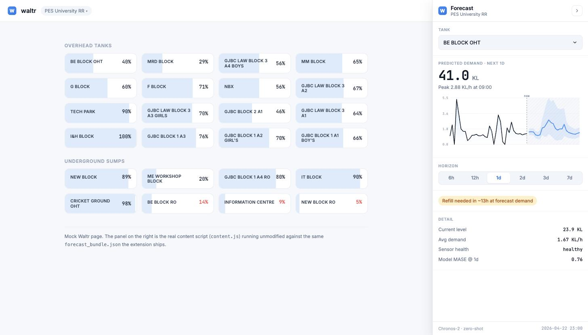
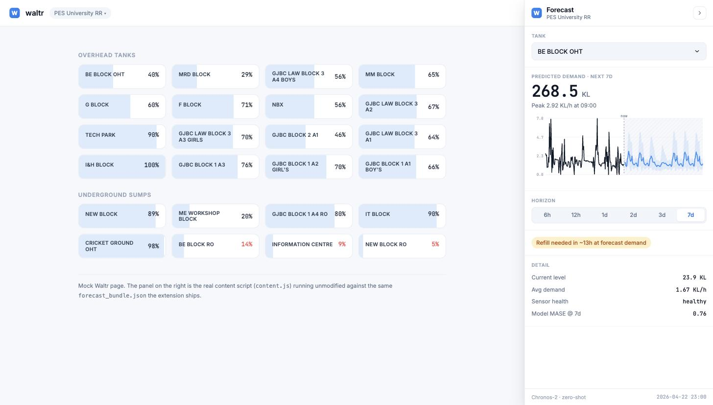

# Waltr Forecast Dock

A collapsible right-edge panel that adds Chronos-2 water-demand forecasts to the Waltr
dashboard at `app.waltr.in`, without altering anything Waltr already renders.



*BE BLOCK OHT at the 1-day horizon. The tank reads 40% — the same figure Waltr shows — because
capacity is taken from the observed sensor range, not tank geometry.*



*The same tank at 7 days: seven diurnal cycles and a p10–p90 band that widens with horizon.*

## What it shows

For any of the 24 PES University RR tanks:

- **Predicted demand** over the selected horizon — 6 h, 12 h, 1 d, 2 d, 3 d or 7 d
- A chart with observed history left of the "now" line and the forecast, with its **p10–p90
  band**, to the right
- **Time to empty** at the forecast demand rate, so the panel answers "do I need to refill"
  rather than only "what is the number"
- The tank's **sensor health tier** and the model's measured **MASE at that horizon**, so a
  number that should not be trusted says so

## Install (unpacked)

1. `chrome://extensions` → enable **Developer mode**
2. **Load unpacked** → select this directory
3. Open `https://app.waltr.in` — the dock appears on the right

Collapse it with the chevron; it reopens from the vertical **Forecast** rail. Tank and horizon
choices persist in `chrome.storage.local`.

## Preview without installing

```bash
cd extension/waltr-dock
python3 -m http.server 8080
# open http://localhost:8080/preview.html
```

`preview.html` shims the two Chrome APIs the content script uses and runs `content.js`
unmodified against a mock Waltr page, so what you see is the real component.

## Design notes

**Shadow DOM.** The dock mounts into a shadow root. Waltr's stylesheet cannot reach in and
`dock.css` cannot leak out, so the host page renders byte-identically to before. It also means a
fixed-position host works whether Waltr paints to the DOM or to a `<canvas>` (as a Flutter Web
build does).

**Self-contained tank selection.** A canvas-rendered host exposes no DOM text to scrape, so the
dock ships its own searchable tank list. URL-based detection is a best-effort enhancement
(`tankFromUrl`), never a dependency — the panel works regardless of how Waltr renders.

**Offline by default.** `forecast_bundle.json` is precomputed and bundled, so the panel needs no
backend and no network. Regenerate it with:

```bash
python -m src.models.build_dock_bundle
```

**Theme.** `waltr-tokens.css` is copied verbatim from the Waltr theme reproduction; `dock.css`
mirrors the same tokens onto `:host`. Colours, radii, Inter/JetBrains Mono, and the 56 px header
height all match the host app.

## Files

| File | Role |
|---|---|
| `manifest.json` | MV3 manifest, scoped to `https://app.waltr.in/*` |
| `content.js` | Shadow-root mount, chart, picker, horizon switching |
| `dock.css` | Panel styles (shadow-scoped) |
| `waltr-tokens.css` | Waltr theme tokens, verbatim |
| `forecast_bundle.json` | Precomputed forecasts (generated) |
| `preview.html` | Standalone harness, no extension install needed |
